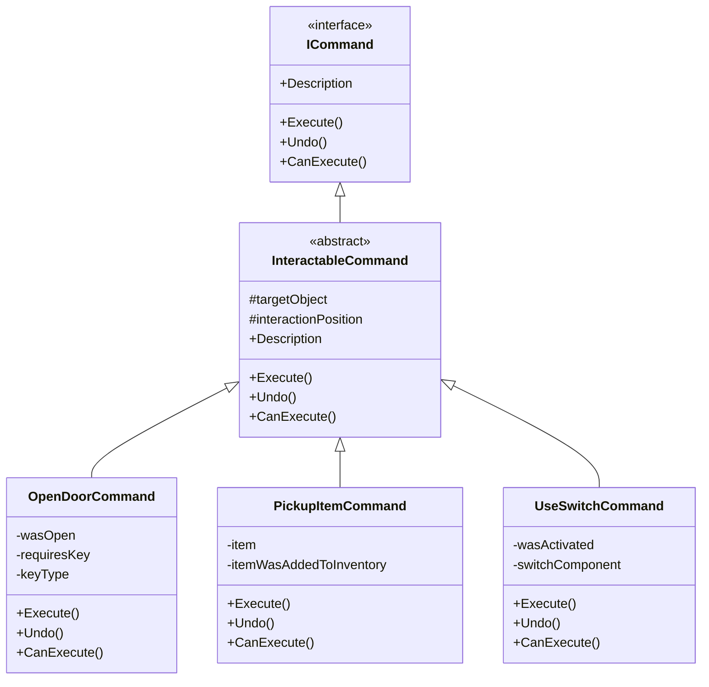

# ⚔️ **Command Pattern - Retro FPS Engine**

## 📖 **Descripción General**

El **Command Pattern** encapsula solicitudes como objetos, permitiendo parametrizar clientes con diferentes solicitudes, encolar solicitudes, registrar solicitudes en un log, y soportar operaciones reversibles (undo/redo).

## 🏗️ **Arquitectura**



## 🎯 **Uso Básico**

### **1. Crear un Comando**

```csharp
// Comando básico que implementa ICommand
public class SimpleCommand : ICommand
{
    public void Execute()
    {
        Debug.Log("Command executed!");
    }

    public void Undo()
    {
        Debug.Log("Command undone!");
    }

    public bool CanExecute()
    {
        return true; // Siempre puede ejecutarse
    }

    public string Description => "Simple command example";
}
```

### **2. Usar un Comando**

```csharp
public class CommandExecutor : MonoBehaviour
{
    private void Update()
    {
        if (Input.GetKeyDown(KeyCode.Space))
        {
            // Crear y ejecutar comando
            ICommand command = new SimpleCommand();
            if (command.CanExecute())
            {
                command.Execute();
            }
        }

        if (Input.GetKeyDown(KeyCode.U))
        {
            // Hacer undo (requiere guardar referencia al comando)
            // command.Undo();
        }
    }
}
```

### **3. Comando Interactivo**

```csharp
// Comando que interactúa con objetos del juego
public class DoorInteractionCommand : InteractableCommand
{
    private bool requiresKey;
    private string keyType;

    public DoorInteractionCommand(GameObject door, bool requiresKey = false, string keyType = "")
        : base(door)
    {
        this.requiresKey = requiresKey;
        this.keyType = keyType;
    }

    public override void Execute()
    {
        if (!CanExecute())
        {
            Debug.LogWarning("Cannot execute door command");
            return;
        }

        // Lógica para abrir puerta
        Door doorComponent = targetObject.GetComponent<Door>();
        if (doorComponent != null)
        {
            doorComponent.Open();
        }

        // Publicar evento
        var doorEvent = new DoorOpenedEvent(targetObject, requiresKey, keyType);
        EventBus.Publish(doorEvent);

        MarkAsExecuted();
    }

    public override void Undo()
    {
        // Lógica para cerrar puerta
        Door doorComponent = targetObject.GetComponent<Door>();
        if (doorComponent != null)
        {
            doorComponent.Close();
        }

        MarkAsUndone();
    }

    public override bool CanExecute()
    {
        if (!base.CanExecute()) return false;

        // Verificar si tiene la llave requerida
        if (requiresKey)
        {
            return HasRequiredKey(keyType);
        }

        return true;
    }

    public override string Description => $"Open door{(requiresKey ? $" (requires {keyType} key)" : "")}";

    private bool HasRequiredKey(string keyType)
    {
        // Verificar con sistema de llaves
        switch (keyType.ToLower())
        {
            case "red": return GameObservers.RedKeyObtained.GetValue();
            case "blue": return GameObservers.BlueKeyObtained.GetValue();
            case "yellow": return GameObservers.YellowKeyObtained.GetValue();
            default: return false;
        }
    }
}
```

## 📋 **Comandos Implementados**

### **OpenDoorCommand**
Abre puertas interactivas con soporte opcional para llaves.

```csharp
var openDoorCommand = new OpenDoorCommand(doorGameObject, true, "red");
openDoorCommand.Execute(); // Abre puerta si tiene llave roja
```

### **PickupItemCommand**
Recoge items del mundo y los agrega al inventario.

```csharp
var pickupCommand = new PickupItemCommand(itemGameObject, itemData);
pickupCommand.Execute(); // Recoge item y lo agrega al inventario
```

### **UseSwitchCommand**
Activa o desactiva switches/interruptores.

```csharp
var switchCommand = new UseSwitchCommand(switchGameObject);
switchCommand.Execute(); // Activa/desactiva el switch
```

## 🎮 **Casos de Uso Avanzados**

### **Sistema de Undo/Redo**

```csharp
public class CommandManager : MonoBehaviour
{
    private Stack<ICommand> executedCommands = new Stack<ICommand>();
    private Stack<ICommand> undoneCommands = new Stack<ICommand>();

    public void ExecuteCommand(ICommand command)
    {
        if (command.CanExecute())
        {
            command.Execute();
            executedCommands.Push(command);
            undoneCommands.Clear(); // Limpiar redo stack
        }
    }

    public void Undo()
    {
        if (executedCommands.Count > 0)
        {
            ICommand command = executedCommands.Pop();
            command.Undo();
            undoneCommands.Push(command);
        }
    }

    public void Redo()
    {
        if (undoneCommands.Count > 0)
        {
            ICommand command = undoneCommands.Pop();
            command.Execute();
            executedCommands.Push(command);
        }
    }
}
```

### **Sistema de Input Mapping**

```csharp
public class InputCommandMapper : MonoBehaviour
{
    [SerializeField] private KeyCode interactKey = KeyCode.E;
    [SerializeField] private KeyCode undoKey = KeyCode.Z;

    private CommandManager commandManager;
    private RaycastHit lastHit;

    private void Start()
    {
        commandManager = GetComponent<CommandManager>();
    }

    private void Update()
    {
        // Detectar objetos interactuables
        if (Physics.Raycast(Camera.main.transform.position, Camera.main.transform.forward, out lastHit, 3f))
        {
            if (Input.GetKeyDown(interactKey))
            {
                CreateAndExecuteCommand(lastHit.collider.gameObject);
            }
        }

        // Undo con Ctrl+Z
        if (Input.GetKeyDown(undoKey) && Input.GetKey(KeyCode.LeftControl))
        {
            commandManager.Undo();
        }
    }

    private void CreateAndExecuteCommand(GameObject target)
    {
        ICommand command = null;

        // Determinar tipo de comando basado en el objeto
        if (target.CompareTag("Door"))
        {
            command = new OpenDoorCommand(target);
        }
        else if (target.CompareTag("Item"))
        {
            // Obtener datos del item
            IItem itemData = target.GetComponent<ItemPickup>().ItemData;
            command = new PickupItemCommand(target, itemData);
        }
        else if (target.CompareTag("Switch"))
        {
            command = new UseSwitchCommand(target);
        }

        if (command != null)
        {
            commandManager.ExecuteCommand(command);
        }
    }
}
```

### **AI Command Queue**

```csharp
public class EnemyAI : MonoBehaviour
{
    private Queue<ICommand> commandQueue = new Queue<ICommand>();
    private ICommand currentCommand;

    public void AddCommand(ICommand command)
    {
        commandQueue.Enqueue(command);
    }

    private void Update()
    {
        // Ejecutar comandos de la cola
        if (currentCommand == null && commandQueue.Count > 0)
        {
            currentCommand = commandQueue.Dequeue();
            if (currentCommand.CanExecute())
            {
                currentCommand.Execute();
                StartCoroutine(WaitForCommandCompletion());
            }
        }
    }

    private System.Collections.IEnumerator WaitForCommandCompletion()
    {
        // Esperar un tiempo o condición específica
        yield return new WaitForSeconds(1f);

        currentCommand = null; // Listo para siguiente comando
    }
}

// Uso
enemyAI.AddCommand(new MoveToPositionCommand(targetPosition));
enemyAI.AddCommand(new AttackCommand(targetEnemy));
enemyAI.AddCommand(new FleeCommand());
```

## 🔧 **Características Avanzadas**

### **Command Composition**

```csharp
// Comando compuesto que ejecuta múltiples comandos
public class CompositeCommand : ICommand
{
    private List<ICommand> commands = new List<ICommand>();

    public void AddCommand(ICommand command)
    {
        commands.Add(command);
    }

    public void Execute()
    {
        foreach (var command in commands)
        {
            if (command.CanExecute())
            {
                command.Execute();
            }
        }
    }

    public void Undo()
    {
        // Undo en orden inverso
        for (int i = commands.Count - 1; i >= 0; i--)
        {
            commands[i].Undo();
        }
    }

    public bool CanExecute()
    {
        // Todos los comandos deben poder ejecutarse
        return commands.All(cmd => cmd.CanExecute());
    }

    public string Description => $"Execute {commands.Count} commands";
}
```

### **Command Logging**

```csharp
public class LoggedCommand : ICommand
{
    private ICommand wrappedCommand;
    private string timestamp;

    public LoggedCommand(ICommand command)
    {
        wrappedCommand = command;
        timestamp = System.DateTime.Now.ToString();
    }

    public void Execute()
    {
        Debug.Log($"[{timestamp}] Executing: {Description}");
        wrappedCommand.Execute();
    }

    public void Undo()
    {
        Debug.Log($"[{timestamp}] Undoing: {Description}");
        wrappedCommand.Undo();
    }

    public bool CanExecute() => wrappedCommand.CanExecute();
    public string Description => wrappedCommand.Description;
}
```

### **Command Validation**

```csharp
public static class CommandExtensions
{
    public static bool TryExecute(this ICommand command)
    {
        if (command.CanExecute())
        {
            command.Execute();
            return true;
        }
        return false;
    }

    public static bool TryUndo(this ICommand command)
    {
        try
        {
            command.Undo();
            return true;
        }
        catch
        {
            Debug.LogWarning($"Failed to undo command: {command.Description}");
            return false;
        }
    }
}
```

## 🔗 **Integración con Otros Patrones**

### **Con Event Bus**

```csharp
public class EventPublishingCommand : InteractableCommand
{
    public override void Execute()
    {
        base.Execute();

        // Publicar evento después de ejecutar
        var interactionEvent = new PlayerInteractedEvent(
            targetObject,
            "command_execution",
            interactionPosition
        );
        EventBus.Publish(interactionEvent);
    }
}
```

### **Con Object Pooling**

```csharp
public class PooledCommand : InteractableCommand
{
    private ObjectPool<PooledCommand> pool;

    public void SetPool(ObjectPool<PooledCommand> commandPool)
    {
        pool = commandPool;
    }

    public override void Execute()
    {
        base.Execute();

        // Retornar al pool después de ejecutar
        if (pool != null)
        {
            pool.Return(this);
        }
    }
}
```

### **Con Observer Pattern**

```csharp
public class ObservableCommand : InteractableCommand
{
    public override void Execute()
    {
        base.Execute();

        // Notificar observers
        GameObservers.PlayerInteracted.UpdateValue(targetObject.name);
    }
}
```

## 🧪 **Testing**

```csharp
[Test]
public void OpenDoorCommand_Execute_OpensDoor()
{
    // Arrange
    var doorObject = new GameObject("TestDoor");
    var doorCommand = new OpenDoorCommand(doorObject);

    // Act
    doorCommand.Execute();

    // Assert
    // Verificar que la puerta se abrió
    Assert.IsTrue(doorCommand.HasBeenExecuted);
}

[Test]
public void CommandManager_Undo_RestoresPreviousState()
{
    // Arrange
    var commandManager = new GameObject().AddComponent<CommandManager>();
    var mockCommand = new MockCommand();

    // Act
    commandManager.ExecuteCommand(mockCommand);
    commandManager.Undo();

    // Assert
    Assert.IsTrue(mockCommand.UndoWasCalled);
}
```

## ⚡ **Performance**

### **Optimizaciones**
- **Lightweight**: Los comandos son objetos simples
- **Poolable**: Pueden ser pooled para reutilización
- **Lazy Evaluation**: CanExecute() solo cuando es necesario
- **Minimal Allocations**: Reutilizar instancias cuando sea posible

### **Recomendaciones**
- **Pooling**: Para comandos usados frecuentemente
- **Validation**: Validar CanExecute() antes de encolar
- **Cleanup**: Limpiar referencias en comandos complejos
- **Memory**: Evitar closures en lambdas de comandos

## 🚨 **Consideraciones Importantes**

### **Estado y Concurrencia**
```csharp
// ❌ MAL: Estado compartido
public class BadCommand : ICommand
{
    public static int SharedCounter = 0; // Estado compartido problemático

    public void Execute()
    {
        SharedCounter++;
    }
}

// ✅ BIEN: Estado encapsulado
public class GoodCommand : ICommand
{
    private int instanceCounter = 0; // Estado por instancia

    public void Execute()
    {
        instanceCounter++;
    }
}
```

### **Undo Complexity**
```csharp
// ❌ MAL: Undo complejo y propenso a errores
public class ComplexUndoCommand : ICommand
{
    public void Undo()
    {
        // Mucha lógica compleja aquí...
        // Difícil de mantener y testear
    }
}

// ✅ BIEN: Undo simple y predecible
public class SimpleUndoCommand : ICommand
{
    private bool originalState;

    public SimpleUndoCommand(bool currentState)
    {
        originalState = currentState;
    }

    public void Execute() { /* Cambiar estado */ }
    public void Undo() { /* Restaurar originalState */ }
}
```

### **Exception Handling**
```csharp
// ✅ MANEJAR EXCEPCIONES
public class SafeCommand : ICommand
{
    public void Execute()
    {
        try
        {
            // Lógica que puede fallar
            DangerousOperation();
        }
        catch (System.Exception ex)
        {
            Debug.LogError($"Command execution failed: {ex.Message}");
            // Manejar error apropiadamente
        }
    }

    public void Undo()
    {
        try
        {
            // Lógica de undo
        }
        catch (System.Exception ex)
        {
            Debug.LogError($"Command undo failed: {ex.Message}");
        }
    }
}
```

## 📚 **Referencias**

- [Command Pattern](https://en.wikipedia.org/wiki/Command_pattern)
- [Game Programming Patterns - Command](https://gameprogrammingpatterns.com/command.html)
- [Unity Command Pattern Examples](https://github.com/UnityPatterns/UnityCommandPattern)

---

**Archivos**: `Commands/ICommand.cs`, `Commands/InteractableCommand.cs`, `Commands/OpenDoorCommand.cs`
**Versión**: 1.0
**Última actualización**: Enero 2026
