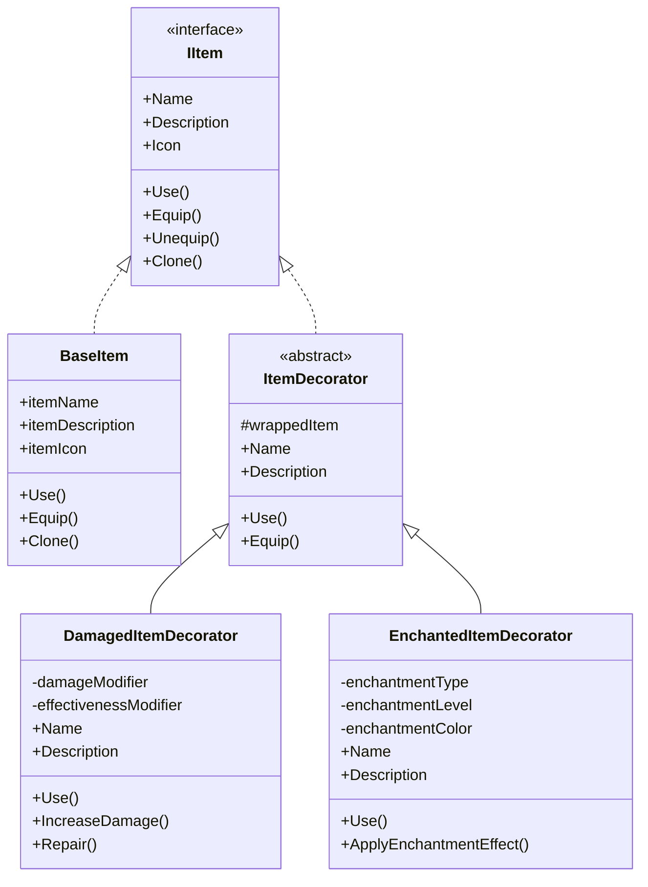

# 🎨 **Decorator Pattern - Retro FPS Engine**

## 📖 **Descripción General**

El **Decorator Pattern** permite agregar responsabilidades adicionales a un objeto dinámicamente, proporcionando una alternativa flexible a la herencia para extender funcionalidad. En el contexto de items, permite crear modificadores como encantamientos, daños, o mejoras temporales.

## 🏗️ **Arquitectura**



## 🎯 **Uso Básico**

### **1. Crear un Item Base**

```csharp
using RetroFPS;

[CreateAssetMenu(fileName = "Sword", menuName = "Retro FPS/Items/Weapons/Sword")]
public class SwordItem : BaseItem
{
    [Header("Sword Properties")]
    [SerializeField] private int baseDamage = 25;
    [SerializeField] private float attackSpeed = 1.5f;

    protected override void OnUse()
    {
        // Lógica específica de espada
        Debug.Log($"Swinging sword for {baseDamage} damage!");
        // Aplicar daño, reproducir animación, etc.
    }

    protected override void OnEquip()
    {
        // Cambiar sprite del jugador, modificar stats, etc.
        Debug.Log("Sword equipped!");
    }
}
```

### **2. Aplicar Decorators**

```csharp
public class ItemDecoratorExample : MonoBehaviour
{
    [SerializeField] private BaseItem baseSword;
    [SerializeField] private BaseItem baseArmor;

    private IItem enchantedSword;
    private IItem damagedArmor;

    private void Start()
    {
        // Crear espada encantada
        enchantedSword = new EnchantedItemDecorator(baseSword, EnchantedItemDecorator.EnchantmentType.FireDamage, 3);

        // Crear armadura dañada
        damagedArmor = new DamagedItemDecorator(baseArmor, 0.6f); // 40% dañada

        Debug.Log($"Enchanted Sword: {enchantedSword.Name}");
        Debug.Log($"Enchanted Description: {enchantedSword.Description}");

        Debug.Log($"Damaged Armor: {damagedArmor.Name}");
        Debug.Log($"Damaged Description: {damagedArmor.Description}");
    }

    private void Update()
    {
        if (Input.GetKeyDown(KeyCode.Alpha1))
        {
            enchantedSword.Use(); // Usar espada encantada
        }

        if (Input.GetKeyDown(KeyCode.Alpha2))
        {
            damagedArmor.Use(); // Usar armadura dañada
        }
    }
}
```

### **3. Combinar Múltiples Decorators**

```csharp
public class AdvancedDecoratorExample : MonoBehaviour
{
    [SerializeField] private BaseItem legendarySword;

    private void CreateLegendaryWeapon()
    {
        // Crear espada legendaria con múltiples encantamientos
        IItem weapon = legendarySword.Clone();

        // Aplicar múltiples decorators
        weapon = new EnchantedItemDecorator(weapon, EnchantedItemDecorator.EnchantmentType.FireDamage, 2);
        weapon = new EnchantedItemDecorator(weapon, EnchantedItemDecorator.EnchantmentType.DamageBoost, 1);
        weapon = new DamagedItemDecorator(weapon, 0.8f); // Ligeramente dañada

        Debug.Log($"Legendary Weapon: {weapon.Name}");
        Debug.Log($"Description: {weapon.Description}");

        // Usar el arma
        weapon.Use();
    }
}
```

## 📋 **Decorators Implementados**

### **DamagedItemDecorator**

Reduce la efectividad de un item basado en su estado de daño.

```csharp
// Crear item 50% dañado
IItem damagedSword = new DamagedItemDecorator(baseSword, 0.5f);

// Aumentar daño con el tiempo
((DamagedItemDecorator)damagedSword).IncreaseDamage(0.1f);

// Reparar parcialmente
((DamagedItemDecorator)damagedSword).Repair(0.2f);
```

**Características:**
- Modificador de daño progresivo
- Chance de fallo al usar
- Efectos visuales de daño
- Sistema de reparación

### **EnchantedItemDecorator**

Agrega bonificaciones y efectos especiales a los items.

```csharp
// Crear espada con daño de fuego nivel 3
IItem fireSword = new EnchantedItemDecorator(baseSword, EnchantedItemDecorator.EnchantmentType.FireDamage, 3);

// Crear botas con velocidad aumentada
IItem speedBoots = new EnchantedItemDecorator(baseBoots, EnchantedItemDecorator.EnchantmentType.SpeedBoost, 2);
```

**Tipos de encantamiento disponibles:**
- `FireDamage` - Daño de fuego adicional
- `IceDamage` - Efectos de congelamiento
- `LightningDamage` - Cadena de rayos
- `PoisonDamage` - Daño por veneno over time
- `Healing` - Cura al usuario
- `SpeedBoost` - Aumenta velocidad
- `DamageBoost` - Aumenta daño base
- `AccuracyBoost` - Mejora precisión
- `DurabilityBoost` - Reduce desgaste
- `LuckBoost` - Mejora suerte

## 🎮 **Casos de Uso Avanzados**

### **Sistema de Inventario con Decorators**

```csharp
public class InventorySystem : MonoBehaviour
{
    private List<IItem> inventory = new List<IItem>();

    public void AddItem(IItem item)
    {
        // Aplicar decorator de "nuevo" a items recién obtenidos
        var newItem = new NewItemDecorator(item);
        inventory.Add(newItem);

        UpdateUI();
    }

    public void DamageItem(IItem item, float damageAmount)
    {
        // Encontrar el item en inventario
        int index = inventory.FindIndex(i => i.Name == item.Name);
        if (index >= 0)
        {
            // Aplicar decorator de daño
            var damagedItem = new DamagedItemDecorator(inventory[index], damageAmount);
            inventory[index] = damagedItem;

            UpdateUI();
        }
    }

    public void EnchantItem(IItem item, EnchantedItemDecorator.EnchantmentType enchantment, int level)
    {
        int index = inventory.FindIndex(i => i.Name == item.Name);
        if (index >= 0)
        {
            var enchantedItem = new EnchantedItemDecorator(inventory[index], enchantment, level);
            inventory[index] = enchantedItem;

            UpdateUI();
        }
    }
}
```

### **Sistema de Crafting**

```csharp
public class CraftingSystem : MonoBehaviour
{
    public IItem CraftWeapon(BaseItem baseWeapon, List<IItem> materials)
    {
        IItem craftedWeapon = baseWeapon.Clone();

        // Aplicar encantamientos basados en materiales
        foreach (var material in materials)
        {
            if (material.Name.Contains("Ruby"))
            {
                craftedWeapon = new EnchantedItemDecorator(
                    craftedWeapon,
                    EnchantedItemDecorator.EnchantmentType.FireDamage,
                    1
                );
            }
            else if (material.Name.Contains("Sapphire"))
            {
                craftedWeapon = new EnchantedItemDecorator(
                    craftedWeapon,
                    EnchantedItemDecorator.EnchantmentType.IceDamage,
                    1
                );
            }
        }

        // Chance de que salga dañado
        if (Random.value < 0.3f) // 30% chance
        {
            craftedWeapon = new DamagedItemDecorator(craftedWeapon, 0.8f);
        }

        return craftedWeapon;
    }
}
```

### **Sistema de Degradación de Items**

```csharp
public class ItemDegradationSystem : MonoBehaviour
{
    [SerializeField] private float degradationRate = 0.01f; // 1% por uso

    private Dictionary<IItem, DamagedItemDecorator> itemDamageMap = new Dictionary<IItem, DamagedItemDecorator>();

    public void OnItemUsed(IItem item)
    {
        // Solo items equipables se degradan
        if (item is IEquippableItem)
        {
            if (!itemDamageMap.ContainsKey(item))
            {
                // Crear decorator de daño si no existe
                itemDamageMap[item] = new DamagedItemDecorator(item, 1.0f); // Sin daño inicialmente
            }

            // Aumentar daño
            itemDamageMap[item].IncreaseDamage(degradationRate);

            // Verificar si está roto
            if (itemDamageMap[item].IsBroken)
            {
                Debug.Log($"{item.Name} se ha roto!");
                // Remover del inventario, etc.
            }
        }
    }
}
```

### **Sistema de Buffs Temporales**

```csharp
public class BuffSystem : MonoBehaviour
{
    public class TemporaryBuffDecorator : ItemDecorator
    {
        private float duration;
        private float elapsedTime;
        private System.Action onBuffExpired;

        public TemporaryBuffDecorator(IItem item, float duration, System.Action onExpired)
            : base(item)
        {
            this.duration = duration;
            onBuffExpired = onExpired;
        }

        public override void Update()
        {
            elapsedTime += Time.deltaTime;
            if (elapsedTime >= duration)
            {
                onBuffExpired?.Invoke();
            }
        }

        public override string Name => $"{wrappedItem.Name} (Buffed)";
        public override string Description => $"{wrappedItem.Description}\nBuff expires in: {duration - elapsedTime:F1}s";
    }

    public void ApplyTemporaryBuff(IItem item, float duration)
    {
        var buffedItem = new TemporaryBuffDecorator(item, duration, () =>
        {
            Debug.Log($"Buff expired for {item.Name}");
            // Remover buff
        });

        // Usar el item buffeado
        StartCoroutine(UpdateBuffTimer(buffedItem));
    }

    private System.Collections.IEnumerator UpdateBuffTimer(TemporaryBuffDecorator buff)
    {
        while (true)
        {
            buff.Update();
            yield return null;
        }
    }
}
```

## 🔧 **Características Avanzadas**

### **Decorator Chaining**

```csharp
// Crear cadena compleja de decorators
IItem legendarySword = baseSword
    .WithEnchantment(EnchantedItemDecorator.EnchantmentType.FireDamage, 3)
    .WithEnchantment(EnchantedItemDecorator.EnchantmentType.DamageBoost, 2)
    .WithDamage(0.2f) // Ligeramente dañado
    .WithTemporaryBuff(30f); // Buff de 30 segundos

// Extension methods para fluent interface
public static class ItemDecoratorExtensions
{
    public static IItem WithEnchantment(this IItem item, EnchantedItemDecorator.EnchantmentType type, int level)
    {
        return new EnchantedItemDecorator(item, type, level);
    }

    public static IItem WithDamage(this IItem item, float damageLevel)
    {
        return new DamagedItemDecorator(item, damageLevel);
    }

    public static IItem WithTemporaryBuff(this IItem item, float duration)
    {
        return new TemporaryBuffDecorator(item, duration, null);
    }
}
```

### **Decorator Removal**

```csharp
public class DynamicDecoratorSystem : MonoBehaviour
{
    public void RemoveEnchantment(IItem item, EnchantedItemDecorator.EnchantmentType typeToRemove)
    {
        if (item is EnchantedItemDecorator enchanted && enchanted.Type == typeToRemove)
        {
            // Remover este decorator, retornar el item base
            item = enchanted.GetBaseItem();
        }
        else if (item is ItemDecorator decorator)
        {
            // Remover de la cadena recursivamente
            item = decorator.RemoveDecorator<EnchantedItemDecorator>();
        }
    }

    public void RepairItem(IItem item)
    {
        if (item.HasDecorator<DamagedItemDecorator>())
        {
            // Reparar completamente
            var damagedDecorator = item as DamagedItemDecorator;
            damagedDecorator.Repair(1.0f); // Reparar al 100%
        }
    }
}
```

### **Decorator Serialization**

```csharp
[System.Serializable]
public class SerializableItemDecorator
{
    public string decoratorType;
    public string parameters;

    // Para DamagedItemDecorator
    // parameters = "damageLevel:0.5"

    // Para EnchantedItemDecorator
    // parameters = "enchantment:FireDamage,level:3"
}

public class ItemSerializationSystem : MonoBehaviour
{
    public string SerializeItem(IItem item)
    {
        List<SerializableItemDecorator> decorators = new List<SerializableItemDecorator>();

        IItem current = item;
        while (current is ItemDecorator decorator)
        {
            var serializable = new SerializableItemDecorator();

            if (decorator is DamagedItemDecorator damaged)
            {
                serializable.decoratorType = "Damaged";
                serializable.parameters = $"damageLevel:{damaged.DamageModifier}";
            }
            else if (decorator is EnchantedItemDecorator enchanted)
            {
                serializable.decoratorType = "Enchanted";
                serializable.parameters = $"enchantment:{enchanted.Type},level:{enchanted.Level}";
            }

            decorators.Add(serializable);
            current = decorator.GetWrappedItem();
        }

        return JsonUtility.ToJson(new { baseItem = current.Name, decorators = decorators });
    }

    public IItem DeserializeItem(string json)
    {
        // Implementar deserialización
        return null;
    }
}
```

## 🔗 **Integración con Otros Patrones**

### **Con Command Pattern**

```csharp
public class EnchantItemCommand : ICommand
{
    private IItem targetItem;
    private EnchantedItemDecorator.EnchantmentType enchantment;
    private int level;

    public EnchantItemCommand(IItem item, EnchantedItemDecorator.EnchantmentType type, int level)
    {
        targetItem = item;
        enchantment = type;
        this.level = level;
    }

    public void Execute()
    {
        // Aplicar encantamiento usando decorator
        targetItem = new EnchantedItemDecorator(targetItem, enchantment, level);
    }

    public void Undo()
    {
        // Remover encantamiento
        if (targetItem is EnchantedItemDecorator enchanted &&
            enchanted.Type == enchantment)
        {
            targetItem = enchanted.GetBaseItem();
        }
    }

    public bool CanExecute() => targetItem != null;
    public string Description => $"Enchant {targetItem.Name} with {enchantment}";
}
```

### **Con Observer Pattern**

```csharp
public class ItemChangeNotifierDecorator : ItemDecorator
{
    public ItemChangeNotifierDecorator(IItem item) : base(item) { }

    public override void Use()
    {
        base.Use();

        // Notificar cambio
        GameObservers.ItemUsed.UpdateValue(Name);
    }

    public override void Equip()
    {
        base.Equip();

        // Notificar equipamiento
        GameObservers.ItemEquipped.UpdateValue(Name);
    }
}
```

### **Con Object Pooling**

```csharp
public class PooledItemDecorator : ItemDecorator
{
    private ObjectPool<PooledItemDecorator> pool;

    public void SetPool(ObjectPool<PooledItemDecorator> itemPool)
    {
        pool = itemPool;
    }

    public override void Use()
    {
        base.Use();

        // Retornar al pool después de usar
        if (pool != null)
        {
            pool.Return(this);
        }
    }
}
```

## 🧪 **Testing**

```csharp
[Test]
public void DamagedItemDecorator_ReduceEffectiveness()
{
    // Arrange
    var baseSword = ScriptableObject.CreateInstance<BaseItem>();
    baseSword.itemName = "Sword";

    // Act
    var damagedSword = new DamagedItemDecorator(baseSword, 0.5f);

    // Assert
    Assert.AreEqual("Sword (Dañado)", damagedSword.Name);
    Assert.IsTrue(damagedSword.Description.Contains("Dañado"));
}

[Test]
public void EnchantedItemDecorator_ApplyEnchantment()
{
    // Arrange
    var baseSword = ScriptableObject.CreateInstance<BaseItem>();
    baseSword.itemName = "Sword";

    // Act
    var enchantedSword = new EnchantedItemDecorator(
        baseSword,
        EnchantedItemDecorator.EnchantmentType.FireDamage,
        2
    );

    // Assert
    Assert.AreEqual("Sword +2", enchantedSword.Name);
    Assert.IsTrue(enchantedSword.Description.Contains("FireDamage"));
}

[Test]
public void ItemDecorator_Chaining()
{
    // Arrange
    var baseItem = ScriptableObject.CreateInstance<BaseItem>();
    baseItem.itemName = "Item";

    // Act
    IItem decoratedItem = new EnchantedItemDecorator(
        new DamagedItemDecorator(baseItem, 0.7f),
        EnchantedItemDecorator.EnchantmentType.Healing,
        1
    );

    // Assert
    Assert.AreEqual("Item (Dañado) +1", decoratedItem.Name);
    Assert.AreEqual(3, decoratedItem.GetDecoratorChain().Split(new[] { " -> " }, System.StringSplitOptions.None).Length);
}
```

## ⚡ **Performance**

### **Optimizaciones**
- **Lazy Evaluation**: Los nombres y descripciones se calculan solo cuando se acceden
- **Shallow Copy**: Clone() reutiliza assets cuando es posible
- **Minimal Allocations**: Los decorators no crean objetos innecesarios
- **Caching**: Resultados de operaciones complejas se cachean

### **Recomendaciones**
- **Pooling**: Usar object pooling para decorators usados frecuentemente
- **Caching**: Cachear resultados de GetDecoratorChain() si se usa mucho
- **Garbage Collection**: Evitar crear/destruir decorators frecuentemente
- **Depth Limit**: Limitar profundidad de decorator chaining para evitar complejidad

## 🚨 **Consideraciones Importantes**

### **Decorator Depth**

```csharp
// ❌ MAL: Cadena demasiado profunda
IItem overDecorated = baseItem;
for (int i = 0; i < 100; i++)
{
    overDecorated = new DamagedItemDecorator(overDecorated, 0.01f);
}
// Esto crea una cadena muy profunda y lenta

// ✅ BIEN: Límite de profundidad
public class SafeDecoratorSystem : MonoBehaviour
{
    private const int MAX_DECORATOR_DEPTH = 10;

    public IItem AddDecorator(IItem item, ItemDecorator decorator)
    {
        int depth = GetDecoratorDepth(item);
        if (depth >= MAX_DECORATOR_DEPTH)
        {
            Debug.LogWarning("Maximum decorator depth reached!");
            return item;
        }

        return decorator;
    }

    private int GetDecoratorDepth(IItem item)
    {
        int depth = 0;
        IItem current = item;
        while (current is ItemDecorator)
        {
            depth++;
            current = ((ItemDecorator)current).GetWrappedItem();
        }
        return depth;
    }
}
```

### **State Synchronization**

```csharp
// ✅ SINCRONIZACIÓN DE ESTADO
public class SynchronizedDecorator : ItemDecorator
{
    private void OnValidate()
    {
        // Sincronizar estado cuando cambie en editor
        if (Application.isEditor)
        {
            SyncWithBaseItem();
        }
    }

    private void SyncWithBaseItem()
    {
        // Asegurar que el decorator esté sincronizado con cambios en el item base
        // Por ejemplo, si cambió el nombre base, actualizar nombre decorado
    }
}
```

### **Thread Safety**

```csharp
// ⚠️ DECORATORS NO SON THREAD-SAFE
// Todos los accesos deben ser en el hilo principal de Unity

public class ThreadSafeDecorator : ItemDecorator
{
    public void SafeUse()
    {
        // Asegurar ejecución en main thread
        UnityMainThreadDispatcher.Instance.Enqueue(() => base.Use());
    }
}
```

## 📚 **Referencias**

- [Decorator Pattern](https://en.wikipedia.org/wiki/Decorator_pattern)
- [Game Programming Patterns - Decorator](https://gameprogrammingpatterns.com/decorator.html)
- [Component-Based Architecture](https://en.wikipedia.org/wiki/Component-based_software_engineering)

---

**Archivos**: `Items/IItem.cs`, `Items/BaseItem.cs`, `Items/ItemDecorator.cs`
**Versión**: 1.0
**Última actualización**: Enero 2026
