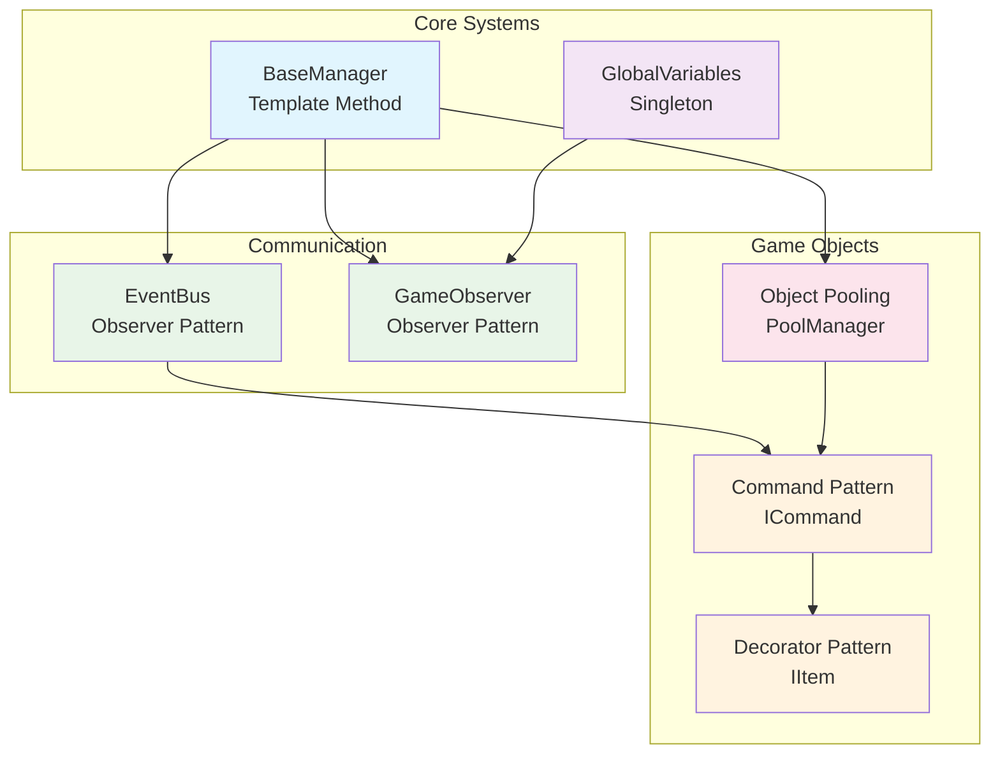
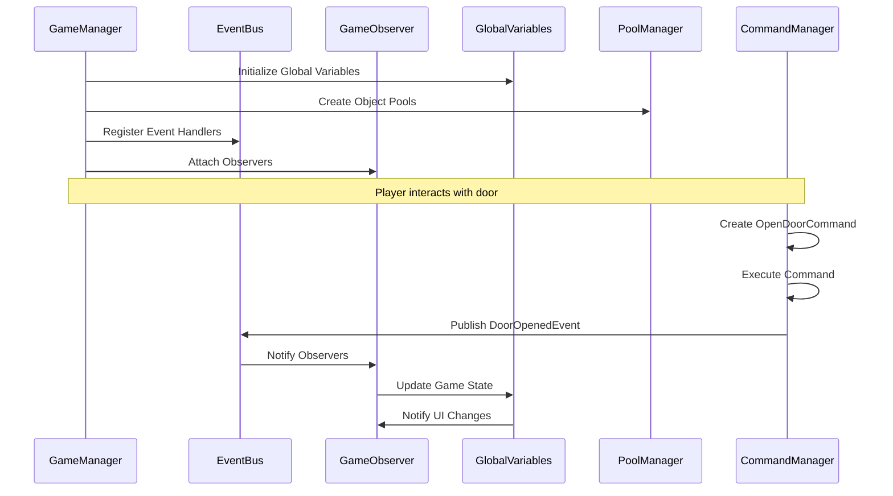

# 🎯 **Patrones de Diseño - Retro FPS Engine**

## 📖 **Introducción**

El **Retro FPS Engine** implementa múltiples patrones de diseño para crear una arquitectura sólida, mantenible y extensible. Esta documentación proporciona una visión general completa de todos los patrones implementados, sus interrelaciones y casos de uso.

## 🏗️ **Arquitectura General**



## 📋 **Patrones Implementados**

| Patrón | Categoría | Estado | Archivo Principal |
|--------|-----------|---------|------------------|
| **Template Method** | Creacional | ✅ Completo | `Core/BaseManager.cs` |
| **Singleton** | Creacional | ✅ Completo | `Core/GlobalVariables.cs` |
| **Observer** | Comportamental | ✅ Completo | `Observer/GameObserver.cs` |
| **Event Bus** | Comportamental | ✅ Completo | `EventBus/EventBus.cs` |
| **Command** | Comportamental | ✅ Completo | `Commands/ICommand.cs` |
| **Decorator** | Estructural | ✅ Completo | `Items/ItemDecorator.cs` |
| **Object Pool** | Creacional | ✅ Completo | `Pooling/ObjectPool.cs` |

## 🎯 **Template Method Pattern**

### **Propósito**
Define el esqueleto de un algoritmo en una clase base, permitiendo que las subclases sobrescriban pasos específicos sin cambiar la estructura general.

### **Implementación**
```csharp
public abstract class BaseManager : MonoBehaviour
{
    // Template Method - algoritmo fijo
    protected virtual void Awake()
    {
        ValidateDependencies();  // Paso 1
        InitializeSingleton();   // Paso 2
        OnInitialize();          // Paso 3 (personalizable)
        RegisterEvents();        // Paso 4
    }

    // Método abstracto que deben implementar las subclases
    protected abstract void OnInitialize();
}
```

### **Casos de Uso**
- **Managers del juego**: `CManagerSFXTemplate`, `CEnemyManagerTemplate`
- **Sistemas inicializables**: Cualquier componente que necesite setup consistente
- **Flujos de trabajo**: Login, guardado, carga de niveles

### **Beneficios**
- ✅ **Consistencia**: Todos los managers siguen el mismo flujo
- ✅ **Reutilización**: Código común en la clase base
- ✅ **Extensibilidad**: Fácil agregar nuevos managers
- ✅ **Mantenibilidad**: Cambios centralizados

## 👁️ **Observer Pattern**

### **Propósito**
Define una relación uno-a-muchos entre objetos, donde cuando un objeto cambia de estado, todos sus dependientes son notificados automáticamente.

### **Implementación**
```csharp
// Observer genérico
public class GameObserver<T>
{
    public void Attach(Action<T> observer) { /* ... */ }
    public void Detach(Action<T> observer) { /* ... */ }
    public void Notify(T data) { /* ... */ }
}

// Observers globales del juego
public static class GameObservers
{
    public static readonly GameObserver<int> PlayerHealthChanged = new GameObserver<int>();
    public static readonly GameObserver<int> PlayerAmmoChanged = new GameObserver<int>();
    // ... más observers
}
```

### **Casos de Uso**
- **UI Updates**: Salud, munición, score
- **Game State**: Cambios de nivel, pausa, game over
- **Audio**: Cambios de volumen, música
- **Inventory**: Items equipados, cambios de cantidad

### **Beneficios**
- ✅ **Decoupling**: UI independiente de lógica de juego
- ✅ **Reactivity**: Actualizaciones automáticas
- ✅ **Extensibility**: Fácil agregar nuevas reacciones
- ✅ **Performance**: Notificaciones eficientes

## 📢 **Event Bus Pattern**

### **Propósito**
Sistema centralizado de comunicación desacoplada entre componentes del juego, permitiendo publicar eventos y suscribirse a ellos sin dependencias directas.

### **Implementación**
```csharp
// Interface base para eventos
public interface IEvent { }

// EventBus centralizado
public static class EventBus
{
    public static void Subscribe<T>(Action<T> handler) where T : IEvent { /* ... */ }
    public static void Publish<T>(T eventData) where T : IEvent { /* ... */ }
}

// Eventos específicos
public class PlayerHealthChangedEvent : IEvent
{
    public int NewHealth { get; set; }
    public int MaxHealth { get; set; }
}
```

### **Casos de Uso**
- **Game Events**: Player died, enemy killed, level completed
- **System Events**: Weapon fired, door opened, item collected
- **Analytics**: Tracking de eventos del jugador
- **Multiplayer**: Sincronización de estado

### **Beneficios**
- ✅ **Loose Coupling**: Componentes independientes
- ✅ **Scalability**: Fácil agregar nuevos eventos
- ✅ **Debugging**: Centralizado y traceable
- ✅ **Type Safety**: Eventos fuertemente tipados

## ⚔️ **Command Pattern**

### **Propósito**
Encapsula una solicitud como un objeto, permitiendo parametrizar clientes con diferentes solicitudes, encolar solicitudes, y soportar operaciones reversibles.

### **Implementación**
```csharp
// Interface del comando
public interface ICommand
{
    void Execute();
    void Undo();
    bool CanExecute();
    string Description { get; }
}

// Comando interactivo
public abstract class InteractableCommand : ICommand
{
    protected GameObject targetObject;

    public abstract void Execute();
    public abstract void Undo();
    public abstract bool CanExecute();
}

// Comandos específicos
public class OpenDoorCommand : InteractableCommand
{
    public override void Execute()
    {
        // Lógica para abrir puerta
        EventBus.Publish(new DoorOpenedEvent(targetObject, requiresKey, keyType));
    }
}
```

### **Casos de Uso**
- **Interactions**: Abrir puertas, recoger items, activar switches
- **Undo/Redo**: Sistema de comandos reversibles
- **Input System**: Mapeo de inputs a acciones
- **AI Behaviors**: Comandos para comportamientos de IA

### **Beneficios**
- ✅ **Reversibility**: Operaciones undo/redo
- ✅ **Queueable**: Encolado de comandos
- ✅ **Parameterizable**: Comandos configurables
- ✅ **Testable**: Fácil testing de comandos individuales

## 🎨 **Decorator Pattern**

### **Propósito**
Permite agregar responsabilidades adicionales a un objeto dinámicamente, proporcionando una alternativa flexible a la herencia para extender funcionalidad.

### **Implementación**
```csharp
// Interface base
public interface IItem
{
    string Name { get; }
    string Description { get; }
    Sprite Icon { get; }
    void Use();
    void Equip();
    IItem Clone();
}

// Decorator base
public abstract class ItemDecorator : IItem
{
    protected IItem wrappedItem;

    public virtual string Name => wrappedItem.Name;
    public virtual string Description => wrappedItem.Description;
    // ... delegación a wrappedItem
}

// Decorators específicos
public class EnchantedItemDecorator : ItemDecorator
{
    public override string Name => $"{wrappedItem.Name} +{enchantmentLevel}";
    public override string Description => $"{wrappedItem.Description}\n[Encantado: {enchantmentType}]";
}
```

### **Casos de Uso**
- **Item Enchantments**: Daño de fuego, velocidad, vida extra
- **Item Conditions**: Dañado, roto, bendecido
- **Temporary Effects**: Buffs temporales, debuffs
- **Modular Upgrades**: Mejoras apilables

### **Beneficios**
- ✅ **Dynamic Composition**: Agregar/quitar en runtime
- ✅ **Single Responsibility**: Cada decorator una funcionalidad
- ✅ **Flexible**: Combinaciones ilimitadas
- ✅ **Maintainable**: Fácil agregar nuevos decorators

## 🏊 **Object Pooling Pattern**

### **Propósito**
Gestiona eficientemente la creación y destrucción de objetos reutilizando instancias existentes, reduciendo la sobrecarga de garbage collection.

### **Implementación**
```csharp
// Pool genérico
public class ObjectPool<T> where T : Component
{
    private readonly Queue<T> availableObjects = new Queue<T>();

    public T Get()
    {
        if (availableObjects.Count > 0)
            return availableObjects.Dequeue();

        // Crear nuevo si no hay disponibles
        return CreateNewObject();
    }

    public void Return(T obj)
    {
        obj.gameObject.SetActive(false);
        availableObjects.Enqueue(obj);
    }
}

// Manager centralizado
public class PoolManager : MonoBehaviour
{
    public static PoolManager Instance { get; private set; }

    public void CreatePool<T>(string poolName, T prefab, int initialSize, int maxSize)
    {
        // Crear y registrar pool
    }
}
```

### **Casos de Uso**
- **Projectiles**: Balas, flechas, misiles
- **Enemies**: Instancias de enemigos
- **Effects**: Partículas, sonidos, explosiones
- **UI Elements**: Tooltips, notifications

### **Beneficios**
- ✅ **Performance**: Reduce GC pressure
- ✅ **Memory Efficient**: Reutilización de objetos
- ✅ **Scalable**: Maneja miles de objetos
- ✅ **Centralized**: Gestión desde un solo lugar

## 🔗 **Integración de Patrones**

### **Flujo Típico de Juego**



### **Relaciones Entre Patrones**

- **Template Method** → Proporciona estructura base para managers
- **Observer** → Comunicación reactiva entre managers
- **Event Bus** → Eventos globales del juego
- **Command** → Acciones ejecutables (usa Event Bus para feedback)
- **Decorator** → Modificación dinámica de items
- **Object Pool** → Optimización de instanciación
- **Singleton** → Instancias globales (GlobalVariables, PoolManager)

## 🧪 **Testing y Debugging**

### **Herramientas de Debug**

Cada patrón incluye métodos de debugging:

```csharp
// Template Method
string debugInfo = manager.GetDebugInfo();

// Observer Pattern
string observerInfo = GameObservers.PlayerHealthChanged.GetDebugInfo();

// Event Bus
string eventInfo = EventBus.GetDebugInfo();

// Object Pooling
string poolInfo = PoolManager.Instance.GetPoolStatistics("EnemyPool");
```

### **Validación**

```csharp
// Validar pools
bool poolsValid = PoolManager.Instance.ValidateAllPools();

// Validar observers
bool observersValid = GameObservers.PlayerHealthChanged.HasObservers;

// Validar EventBus
bool hasHandlers = EventBus.HasHandlers<PlayerHealthChangedEvent>();
```

## 📚 **Referencias y Recursos**

### **Lecturas Recomendadas**
- **Design Patterns** - Gang of Four
- **Game Programming Patterns** - Robert Nystrom
- **Unity Patterns** - Comunidad Unity

### **Documentación Específica**
- [EventBus System](EventBus_System.md)
- [Command Pattern](Command_Pattern.md)
- [Decorator Pattern](Decorator_Pattern.md)
- [Observer Pattern](Observer_Pattern.md)
- [Object Pooling](Object_Pooling.md)
- [Template Method](Template_Method.md)

### **Ejemplos de Código**
- `Core/PatternsIntegration.cs` - Demostración integrada
- `Core/CManagerSFXTemplate.cs` - Template Method ejemplo
- `Core/CEnemyManagerTemplate.cs` - Template Method ejemplo

## 🚀 **Próximos Pasos**

### **Patrones Futuros**
- **State Pattern** - Estados del jugador/juego
- **Strategy Pattern** - Algoritmos intercambiables
- **Factory Pattern** - Creación de objetos complejos

### **Mejoras Planeadas**
- **Async Support** - Operaciones asíncronas
- **Serialization** - Persistencia de estado
- **Thread Safety** - Soporte multihilo
- **Performance Monitoring** - Métricas detalladas

---

**Versión**: 1.0
**Fecha**: Enero 2026
**Autor**: Retro FPS Engine Team
