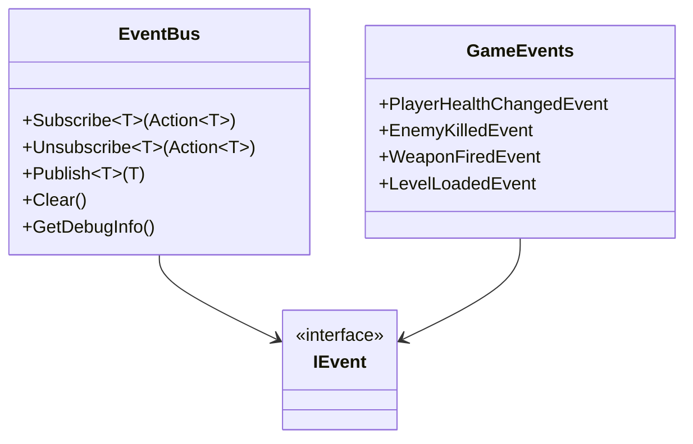

# 📢 **Event Bus System - Retro FPS Engine**

## 📖 **Descripción General**

El **Event Bus System** es un patrón de comunicación centralizada que permite el desacoplamiento completo entre componentes del juego. Actúa como un bus de eventos global donde los publicadores envían eventos y los suscriptores los reciben sin conocerse mutuamente.

## 🏗️ **Arquitectura**



## 🎯 **Uso Básico**

### **1. Definir un Evento**

```csharp
// Crear una clase de evento que implemente IEvent
public class PlayerHealthChangedEvent : IEvent
{
    public int NewHealth { get; set; }
    public int MaxHealth { get; set; }
    public int HealthDifference { get; set; }

    public PlayerHealthChangedEvent(int newHealth, int maxHealth, int difference)
    {
        NewHealth = newHealth;
        MaxHealth = maxHealth;
        HealthDifference = difference;
    }
}
```

### **2. Suscribirse a un Evento**

```csharp
using RetroFPS;

public class HealthUI : MonoBehaviour
{
    private void Start()
    {
        // Suscribirse al evento de cambio de salud
        EventBus.Subscribe<PlayerHealthChangedEvent>(OnPlayerHealthChanged);
    }

    private void OnPlayerHealthChanged(PlayerHealthChangedEvent evt)
    {
        // Actualizar UI con la nueva salud
        healthBar.fillAmount = (float)evt.NewHealth / evt.MaxHealth;
        healthText.text = $"{evt.NewHealth}/{evt.MaxHealth}";
    }

    private void OnDestroy()
    {
        // IMPORTANTE: Desuscribirse para evitar memory leaks
        EventBus.Unsubscribe<PlayerHealthChangedEvent>(OnPlayerHealthChanged);
    }
}
```

### **3. Publicar un Evento**

```csharp
using RetroFPS;

public class PlayerHealth : MonoBehaviour
{
    private int currentHealth = 100;
    private const int maxHealth = 100;

    public void TakeDamage(int damage)
    {
        int oldHealth = currentHealth;
        currentHealth = Mathf.Max(0, currentHealth - damage);
        int difference = currentHealth - oldHealth;

        // Publicar evento de cambio de salud
        var healthEvent = new PlayerHealthChangedEvent(currentHealth, maxHealth, difference);
        EventBus.Publish(healthEvent);

        if (currentHealth <= 0)
        {
            Die();
        }
    }

    private void Die()
    {
        // Publicar evento de muerte
        var deathEvent = new PlayerDiedEvent(transform.position, "Enemy Attack");
        EventBus.Publish(deathEvent);
    }
}
```

## 📋 **Eventos del Juego Incluidos**

### **Player Events**
- `PlayerHealthChangedEvent` - Cambio en salud del jugador
- `PlayerAmmoChangedEvent` - Cambio en munición
- `PlayerDiedEvent` - Jugador murió
- `PlayerItemCollectedEvent` - Item recolectado

### **Enemy Events**
- `EnemyKilledEvent` - Enemigo destruido
- `EnemySpawnedEvent` - Enemigo creado
- `EnemyDetectedPlayerEvent` - Enemigo detectó al jugador

### **Weapon Events**
- `WeaponFiredEvent` - Arma disparada
- `WeaponReloadedEvent` - Arma recargada
- `WeaponSwitchedEvent` - Cambio de arma

### **Level Events**
- `LevelLoadedEvent` - Nivel cargado
- `LevelCompletedEvent` - Nivel completado
- `LevelFailedEvent` - Nivel fallido

### **UI Events**
- `GamePausedEvent` - Juego pausado
- `MainMenuOpenedEvent` - Menú principal abierto

### **Dialogue Events**
- `DialogueStartedEvent` - Diálogo iniciado
- `DialogueCompletedEvent` - Diálogo completado

### **Score Events**
- `ScoreChangedEvent` - Puntaje cambió
- `SecretFoundEvent` - Secreto encontrado

### **Interaction Events**
- `PlayerInteractedEvent` - Jugador interactuó
- `DoorOpenedEvent` - Puerta abierta
- `SwitchActivatedEvent` - Switch activado

## 🔧 **Características Avanzadas**

### **Type Safety**
```csharp
// El sistema es completamente type-safe
EventBus.Subscribe<PlayerHealthChangedEvent>(handler); // ✅ Correcto
EventBus.Subscribe<string>(handler); // ❌ Error de compilación
```

### **Manejo de Errores**
```csharp
// Los errores en handlers no rompen el sistema
EventBus.Subscribe<PlayerHealthChangedEvent>(evt =>
{
    // Si esto lanza una excepción...
    throw new System.Exception("Error en handler");
    // ...el sistema continúa y registra el error
});
```

### **Debugging**
```csharp
// Obtener información de debug
string debugInfo = EventBus.GetDebugInfo();
Debug.Log(debugInfo);
// Output:
// EventBus Debug Info:
// - Event types registered: 5
// - PlayerHealthChangedEvent: 3 handlers
// - EnemyKilledEvent: 1 handlers
// ...
```

### **Limpieza**
```csharp
// Limpiar todos los handlers (útil para cambio de escenas)
EventBus.Clear();
```

## 🎮 **Casos de Uso Prácticos**

### **Sistema de UI Reactiva**

```csharp
public class GameUI : MonoBehaviour
{
    [SerializeField] private TextMeshProUGUI healthText;
    [SerializeField] private TextMeshProUGUI scoreText;
    [SerializeField] private TextMeshProUGUI ammoText;

    private void Start()
    {
        // Suscribirse a múltiples eventos
        EventBus.Subscribe<PlayerHealthChangedEvent>(UpdateHealthUI);
        EventBus.Subscribe<ScoreChangedEvent>(UpdateScoreUI);
        EventBus.Subscribe<PlayerAmmoChangedEvent>(UpdateAmmoUI);
        EventBus.Subscribe<GamePausedEvent>(OnGamePaused);
    }

    private void UpdateHealthUI(PlayerHealthChangedEvent evt)
    {
        healthText.text = $"{evt.NewHealth}/{evt.MaxHealth}";
        healthText.color = evt.NewHealth < 25 ? Color.red : Color.white;
    }

    private void UpdateScoreUI(ScoreChangedEvent evt)
    {
        scoreText.text = evt.NewScore.ToString();
    }

    private void UpdateAmmoUI(PlayerAmmoChangedEvent evt)
    {
        ammoText.text = $"{evt.NewAmmo}/{evt.MaxAmmo}";
    }

    private void OnGamePaused(GamePausedEvent evt)
    {
        // Mostrar/ocultar pause menu
        pauseMenu.SetActive(evt.IsPaused);
    }
}
```

### **Sistema de Logros**

```csharp
public class AchievementSystem : MonoBehaviour
{
    private int enemiesKilled = 0;
    private bool firstKillAchieved = false;

    private void Start()
    {
        EventBus.Subscribe<EnemyKilledEvent>(OnEnemyKilled);
        EventBus.Subscribe<LevelCompletedEvent>(OnLevelCompleted);
    }

    private void OnEnemyKilled(EnemyKilledEvent evt)
    {
        enemiesKilled++;

        if (!firstKillAchieved && enemiesKilled >= 1)
        {
            UnlockAchievement("First Blood");
            firstKillAchieved = true;
        }

        if (enemiesKilled >= 10)
        {
            UnlockAchievement("Killing Spree");
        }
    }

    private void OnLevelCompleted(LevelCompletedEvent evt)
    {
        if (evt.CompletionTime < 300f) // 5 minutos
        {
            UnlockAchievement("Speed Runner");
        }
    }

    private void UnlockAchievement(string achievementName)
    {
        Debug.Log($"Achievement Unlocked: {achievementName}");
        // Mostrar notificación, guardar progreso, etc.
    }
}
```

### **Sistema de Audio**

```csharp
public class AudioManager : MonoBehaviour
{
    [SerializeField] private AudioClip enemyDeathSound;
    [SerializeField] private AudioClip levelCompleteSound;

    private void Start()
    {
        EventBus.Subscribe<EnemyKilledEvent>(OnEnemyKilled);
        EventBus.Subscribe<LevelCompletedEvent>(OnLevelCompleted);
        EventBus.Subscribe<WeaponFiredEvent>(OnWeaponFired);
    }

    private void OnEnemyKilled(EnemyKilledEvent evt)
    {
        PlaySoundAtPosition(enemyDeathSound, evt.DeathPosition);
    }

    private void OnLevelCompleted(LevelCompletedEvent evt)
    {
        PlaySound(levelCompleteSound);
    }

    private void OnWeaponFired(WeaponFiredEvent evt)
    {
        // Reproducir sonido de disparo basado en el tipo de arma
        AudioClip fireSound = GetWeaponSound(evt.WeaponName);
        PlaySoundAtPosition(fireSound, evt.FirePosition);
    }

    private void PlaySound(AudioClip clip)
    {
        // Implementar reproducción de audio
    }

    private void PlaySoundAtPosition(AudioClip clip, Vector3 position)
    {
        // Implementar audio 3D
    }

    private AudioClip GetWeaponSound(string weaponName)
    {
        // Retornar sonido apropiado para el arma
        return null;
    }
}
```

## 🔄 **Compatibilidad con Sistema Legacy**

El EventBus es compatible con el sistema de eventos existente (`CGameEvent`):

```csharp
// Los eventos publicados en CGameEvent se propagan automáticamente al EventBus
CGameEvents.OnPlayerDeath.Publish("Fell into pit");

// Esto también estará disponible en EventBus
EventBus.Subscribe<PlayerDiedEvent>(handler); // Recibirá el evento
```

## ⚡ **Performance**

### **Optimizaciones**
- **Lazy Initialization**: Los diccionarios se crean solo cuando se usan
- **Efficient Lookup**: Búsqueda O(1) por tipo de evento
- **Minimal Allocations**: Reutilización de estructuras internas
- **Error Isolation**: Un handler fallido no afecta otros

### **Recomendaciones**
- **Suscripción**: Hacer en `Start()` o `Awake()`
- **Desuscripción**: Siempre en `OnDestroy()`
- **Frecuencia**: Usar para eventos poco frecuentes
- **Payload**: Mantener eventos ligeros

## 🧪 **Testing**

```csharp
[Test]
public void EventBus_Publish_NotifiesSubscribers()
{
    // Arrange
    bool eventReceived = false;
    var testEvent = new PlayerHealthChangedEvent(50, 100, -50);

    EventBus.Subscribe<PlayerHealthChangedEvent>(evt =>
    {
        eventReceived = true;
        Assert.AreEqual(50, evt.NewHealth);
    });

    // Act
    EventBus.Publish(testEvent);

    // Assert
    Assert.IsTrue(eventReceived);
}
```

## 🚨 **Consideraciones Importantes**

### **Memory Leaks**
```csharp
// ❌ MAL: No desuscribirse
public class BadExample : MonoBehaviour
{
    void Start()
    {
        EventBus.Subscribe<PlayerHealthChangedEvent>(OnHealthChanged);
        // Si este objeto se destruye, el handler queda registrado
    }

    void OnHealthChanged(PlayerHealthChangedEvent evt) { }
}

// ✅ BIEN: Desuscribirse correctamente
public class GoodExample : MonoBehaviour
{
    void Start()
    {
        EventBus.Subscribe<PlayerHealthChangedEvent>(OnHealthChanged);
    }

    void OnDestroy()
    {
        EventBus.Unsubscribe<PlayerHealthChangedEvent>(OnHealthChanged);
    }

    void OnHealthChanged(PlayerHealthChangedEvent evt) { }
}
```

### **Thread Safety**
- El EventBus **NO** es thread-safe
- Todos los eventos deben ejecutarse en el hilo principal de Unity
- Para eventos multihilo, usar `UnityMainThreadDispatcher`

### **Event Ordering**
- Los handlers se ejecutan en orden de suscripción
- No hay garantías de orden entre diferentes tipos de eventos
- Evitar dependencias entre handlers del mismo evento

## 📚 **Referencias**

- [Event-Driven Architecture](https://en.wikipedia.org/wiki/Event-driven_architecture)
- [Observer Pattern vs Event Bus](https://martinfowler.com/articles/201701-event-driven.html)
- [Unity Events System](https://docs.unity3d.com/ScriptReference/Events.UnityEvent.html)

---

**Archivo**: `EventBus/EventBus.cs`
**Versión**: 1.0
**Última actualización**: Enero 2026
