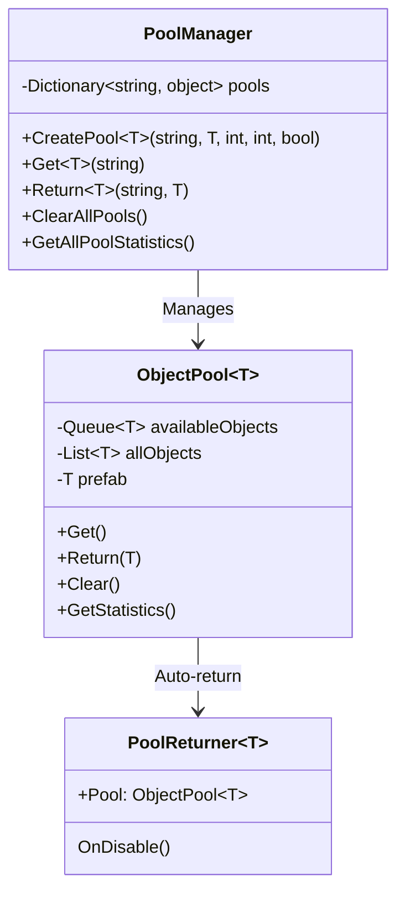

# 🏊 **Object Pooling Pattern - Retro FPS Engine**

## 📖 **Descripción General**

El **Object Pooling Pattern** gestiona eficientemente la creación y destrucción de instancias de objetos reutilizando objetos existentes. En juegos FPS, es crucial para optimizar el rendimiento al manejar grandes cantidades de objetos como proyectiles, efectos de partículas, y enemigos.

## 🏗️ **Arquitectura**



## 🎯 **Uso Básico**

### **1. Crear un Pool Simple**

```csharp
using RetroFPS;

public class ProjectileSpawner : MonoBehaviour
{
    [SerializeField] private GameObject projectilePrefab;
    [SerializeField] private int initialPoolSize = 20;
    [SerializeField] private int maxPoolSize = 100;

    private ObjectPool<Projectile> projectilePool;

    private void Start()
    {
        // Crear pool de proyectiles
        projectilePool = new ObjectPool<Projectile>(
            projectilePrefab.GetComponent<Projectile>(),
            initialPoolSize,    // Tamaño inicial
            transform,         // Padre para organización
            maxPoolSize,       // Tamaño máximo
            true               // Auto-expand
        );
    }

    private void Update()
    {
        if (Input.GetMouseButtonDown(0))
        {
            SpawnProjectile();
        }
    }

    private void SpawnProjectile()
    {
        // Obtener proyectil del pool
        Projectile projectile = projectilePool.Get();

        if (projectile != null)
        {
            // Configurar proyectil
            projectile.transform.position = transform.position;
            projectile.transform.rotation = transform.rotation;
            projectile.Initialize();

            // Auto-retornar al pool después de tiempo
            projectile.ReturnToPoolAfterDelay(projectilePool, 5f);
        }
        else
        {
            Debug.LogWarning("No available projectiles in pool!");
        }
    }
}
```

### **2. Usar PoolManager**

```csharp
using RetroFPS;

public class GameManager : MonoBehaviour
{
    private void Start()
    {
        // Crear pools comunes
        CreateCommonPools();

        // Spawnear objetos usando pools
        SpawnEnemy();
        SpawnParticleEffect();
    }

    private void CreateCommonPools()
    {
        // Pool de enemigos
        GameObject enemyPrefab = Resources.Load<GameObject>("Prefabs/Enemy");
        PoolManager.Instance.CreatePool("Enemy", enemyPrefab.GetComponent<Enemy>(), 10, 50);

        // Pool de efectos de impacto
        GameObject impactPrefab = Resources.Load<GameObject>("Prefabs/ImpactEffect");
        PoolManager.Instance.CreatePool("ImpactEffect", impactPrefab.GetComponent<ParticleSystem>(), 15, 100);

        // Pool de balas
        GameObject bulletPrefab = Resources.Load<GameObject>("Prefabs/Bullet");
        PoolManager.Instance.CreatePool("Bullet", bulletPrefab.GetComponent<Bullet>(), 30, 200);
    }

    private void SpawnEnemy()
    {
        Enemy enemy = PoolManager.Instance.Get<Enemy>("Enemy");
        if (enemy != null)
        {
            enemy.transform.position = GetRandomSpawnPosition();
            enemy.Initialize();

            // Configurar auto-retorno cuando muera
            enemy.OnDeath += () => PoolManager.Instance.Return("Enemy", enemy);
        }
    }

    private void SpawnParticleEffect()
    {
        ParticleSystem effect = PoolManager.Instance.Get<ParticleSystem>("ImpactEffect");
        if (effect != null)
        {
            effect.transform.position = transform.position;
            effect.Play();

            // Retornar después de que termine la partícula
            StartCoroutine(ReturnAfterParticleFinished(effect));
        }
    }

    private System.Collections.IEnumerator ReturnAfterParticleFinished(ParticleSystem effect)
    {
        // Esperar a que termine la partícula
        yield return new WaitForSeconds(effect.main.duration);

        // Retornar al pool
        PoolManager.Instance.Return("ImpactEffect", effect);
    }
}
```

### **3. Auto-Return con PoolReturner**

```csharp
public class Bullet : MonoBehaviour
{
    [SerializeField] private float lifetime = 3f;
    [SerializeField] private float speed = 20f;

    private Rigidbody rb;

    private void Awake()
    {
        rb = GetComponent<Rigidbody>();
    }

    public void Initialize()
    {
        // Configurar física
        rb.velocity = transform.forward * speed;

        // Auto-destruir después de tiempo
        Destroy(gameObject, lifetime);
    }

    private void OnCollisionEnter(Collision collision)
    {
        // Crear efecto de impacto
        SpawnImpactEffect(collision.contacts[0].point);

        // Destruir bala (volverá al pool automáticamente si está configurado)
        Destroy(gameObject);
    }

    private void SpawnImpactEffect(Vector3 position)
    {
        // Obtener efecto del pool y retornarlo automáticamente
        var effect = PoolManager.Instance.GetWithAutoReturn<ParticleSystem>("ImpactEffect", true);
        if (effect != null)
        {
            effect.transform.position = position;
            effect.Play();
        }
    }
}
```

## 📋 **Características del Sistema**

### **ObjectPool<T>**

**Métodos principales:**
- `Get()` - Obtiene objeto disponible
- `Return(T obj)` - Retorna objeto al pool
- `Clear()` - Destruye todos los objetos
- `GetStatistics()` - Estadísticas de uso

**Configuraciones:**
- **Initial Size**: Objetos creados al inicio
- **Max Size**: Límite superior (0 = ilimitado)
- **Auto Expand**: Crecer automáticamente cuando se agote
- **Parent**: Transform padre para organización

### **PoolManager**

**Métodos principales:**
- `CreatePool<T>()` - Crea nuevo pool
- `Get<T>()` - Obtiene objeto de pool
- `Return<T>()` - Retorna objeto a pool
- `ClearAllPools()` - Limpia todos los pools

**Características:**
- Singleton global
- Gestión centralizada
- Estadísticas detalladas
- Soporte para Addressables

## 🎮 **Casos de Uso Avanzados**

### **Sistema de Partículas Optimizado**

```csharp
public class ParticleManager : MonoBehaviour
{
    private Dictionary<string, ObjectPool<ParticleSystem>> particlePools =
        new Dictionary<string, ObjectPool<ParticleSystem>>();

    public void InitializeParticlePools()
    {
        // Crear pools para diferentes tipos de efectos
        CreateParticlePool("BloodSplat", 10, 50);
        CreateParticlePool("Explosion", 5, 20);
        CreateParticlePool("MuzzleFlash", 15, 75);
        CreateParticlePool("BulletTrail", 20, 100);
    }

    private void CreateParticlePool(string effectName, int initialSize, int maxSize)
    {
        string path = $"Particles/{effectName}";
        GameObject prefab = Resources.Load<GameObject>(path);

        if (prefab != null)
        {
            var pool = new ObjectPool<ParticleSystem>(
                prefab.GetComponent<ParticleSystem>(),
                initialSize,
                transform,
                maxSize,
                true
            );

            particlePools[effectName] = pool;
        }
    }

    public void PlayParticleEffect(string effectName, Vector3 position, Quaternion rotation = default)
    {
        if (particlePools.TryGetValue(effectName, out var pool))
        {
            var effect = pool.Get();
            if (effect != null)
            {
                effect.transform.position = position;
                effect.transform.rotation = rotation;
                effect.Play();

                // Retornar al pool cuando termine
                StartCoroutine(ReturnParticleWhenFinished(effect, pool));
            }
        }
    }

    private System.Collections.IEnumerator ReturnParticleWhenFinished(ParticleSystem effect, ObjectPool<ParticleSystem> pool)
    {
        // Esperar duración de la partícula
        yield return new WaitForSeconds(effect.main.duration + effect.main.startLifetime.constantMax);

        // Asegurar que esté parada
        effect.Stop();
        effect.Clear();

        // Retornar al pool
        pool.Return(effect);
    }
}
```

### **Sistema de Enemigos con Pooling**

```csharp
public class EnemyManager : MonoBehaviour
{
    [System.Serializable]
    public class EnemyTypeConfig
    {
        public string enemyType;
        public GameObject prefab;
        public int initialPoolSize = 5;
        public int maxPoolSize = 20;
    }

    [SerializeField] private EnemyTypeConfig[] enemyConfigs;

    private void Start()
    {
        // Crear pools para cada tipo de enemigo
        foreach (var config in enemyConfigs)
        {
            PoolManager.Instance.CreatePool(
                config.enemyType,
                config.prefab.GetComponent<Enemy>(),
                config.initialPoolSize,
                config.maxPoolSize
            );
        }
    }

    public Enemy SpawnEnemy(string enemyType, Vector3 position)
    {
        var enemy = PoolManager.Instance.Get<Enemy>(enemyType);
        if (enemy != null)
        {
            enemy.transform.position = position;
            enemy.Initialize();

            // Configurar retorno al pool cuando muera
            enemy.OnDeath += () => {
                PoolManager.Instance.Return(enemyType, enemy);
                OnEnemyReturned(enemyType);
            };

            return enemy;
        }

        return null;
    }

    private void OnEnemyReturned(string enemyType)
    {
        // Actualizar estadísticas, etc.
        Debug.Log($"{enemyType} returned to pool");
    }

    public void PreloadEnemies(string enemyType, int count)
    {
        PoolManager.Instance.PreloadPool(enemyType, count);
    }

    public void ClearAllEnemies()
    {
        foreach (var config in enemyConfigs)
        {
            PoolManager.Instance.RemovePool(config.enemyType);
        }
    }
}
```

### **Sistema de Projectiles con Trail**

```csharp
public class ProjectileManager : MonoBehaviour
{
    [SerializeField] private GameObject projectilePrefab;
    [SerializeField] private GameObject trailPrefab;

    private ObjectPool<Projectile> projectilePool;
    private ObjectPool<TrailRenderer> trailPool;

    private void Start()
    {
        // Crear pools
        projectilePool = new ObjectPool<Projectile>(
            projectilePrefab.GetComponent<Projectile>(),
            20, transform, 100, true
        );

        trailPool = new ObjectPool<TrailRenderer>(
            trailPrefab.GetComponent<TrailRenderer>(),
            20, transform, 100, true
        );
    }

    public void FireProjectile(Vector3 position, Vector3 direction, float speed)
    {
        // Obtener proyectil
        var projectile = projectilePool.Get();
        if (projectile == null) return;

        // Obtener trail
        var trail = trailPool.Get();
        if (trail != null)
        {
            trail.transform.SetParent(projectile.transform);
            trail.transform.localPosition = Vector3.zero;
            trail.Clear(); // Limpiar trail anterior
        }

        // Configurar proyectil
        projectile.transform.position = position;
        projectile.transform.rotation = Quaternion.LookRotation(direction);
        projectile.Initialize(speed, trail);

        // Configurar retorno conjunto
        projectile.OnDestroyed += () => {
            projectilePool.Return(projectile);
            if (trail != null)
            {
                trailPool.Return(trail);
            }
        };
    }
}
```

### **Sistema de Audio con Pooling**

```csharp
public class AudioPoolManager : MonoBehaviour
{
    [SerializeField] private int maxConcurrentSounds = 32;
    [SerializeField] private Transform audioParent;

    private ObjectPool<AudioSource> audioSourcePool;

    private void Start()
    {
        // Crear pool de AudioSources
        GameObject audioSourcePrefab = new GameObject("PooledAudioSource");
        audioSourcePrefab.AddComponent<AudioSource>();
        audioSourcePrefab.GetComponent<AudioSource>().playOnAwake = false;

        audioSourcePool = new ObjectPool<AudioSource>(
            audioSourcePrefab.GetComponent<AudioSource>(),
            16, // Initial size
            audioParent,
            maxConcurrentSounds,
            true
        );

        Destroy(audioSourcePrefab); // El pool mantiene su propia instancia
    }

    public void PlaySound(AudioClip clip, Vector3 position, float volume = 1f, float spatialBlend = 1f)
    {
        var audioSource = audioSourcePool.Get();
        if (audioSource == null)
        {
            Debug.LogWarning("No available audio sources!");
            return;
        }

        // Configurar AudioSource
        audioSource.transform.position = position;
        audioSource.clip = clip;
        audioSource.volume = volume;
        audioSource.spatialBlend = spatialBlend; // 0 = 2D, 1 = 3D
        audioSource.Play();

        // Retornar al pool cuando termine
        StartCoroutine(ReturnAudioSourceWhenFinished(audioSource, clip.length));
    }

    private System.Collections.IEnumerator ReturnAudioSourceWhenFinished(AudioSource source, float duration)
    {
        yield return new WaitForSeconds(duration + 0.1f);

        // Resetear configuración
        source.Stop();
        source.clip = null;
        source.volume = 1f;
        source.spatialBlend = 0f;

        // Retornar al pool
        audioSourcePool.Return(source);
    }
}
```

## 🔧 **Características Avanzadas**

### **Pool con Precarga Inteligente**

```csharp
public class SmartPoolManager : MonoBehaviour
{
    private Dictionary<string, ObjectPool<GameObject>> pools = new Dictionary<string, ObjectPool<GameObject>>();

    public void CreateSmartPool(string poolName, GameObject prefab, int initialSize, int maxSize)
    {
        var pool = new ObjectPool<GameObject>(prefab, initialSize, transform, maxSize, true);
        pools[poolName] = pool;

        // Comenzar monitoreo de uso
        StartCoroutine(MonitorPoolUsage(poolName, pool));
    }

    private System.Collections.IEnumerator MonitorPoolUsage(string poolName, ObjectPool<GameObject> pool)
    {
        while (true)
        {
            var stats = pool.GetStatistics();

            // Si el pool está muy utilizado, precargar más objetos
            if (stats.UtilizationRate > 0.8f && pool.AvailableCount < 5)
            {
                int preloadCount = Mathf.Min(10, pool.MaxSize - pool.TotalCount);
                if (preloadCount > 0)
                {
                    pool.Preload(preloadCount);
                    Debug.Log($"Preloaded {preloadCount} objects for pool '{poolName}'");
                }
            }

            // Si el pool tiene muchos objetos sin usar, reducir tamaño
            if (stats.UtilizationRate < 0.3f && pool.AvailableCount > 20)
            {
                pool.Shrink(pool.TotalCount / 2);
                Debug.Log($"Shrunk pool '{poolName}' to {pool.TotalCount} objects");
            }

            yield return new WaitForSeconds(5f); // Verificar cada 5 segundos
        }
    }
}
```

### **Pool con Addressables**

```csharp
public class AddressablePoolManager : MonoBehaviour
{
    public async void CreatePoolFromAddressable(string poolName, string address, int initialSize, int maxSize)
    {
        try
        {
            // Cargar prefab usando Addressables
            var handle = Addressables.LoadAssetAsync<GameObject>(address);
            await handle.Task;

            if (handle.Status == UnityEngine.ResourceManagement.AsyncOperations.AsyncOperationStatus.Succeeded)
            {
                var prefab = handle.Result;
                var component = prefab.GetComponent<MonoBehaviour>();

                if (component != null)
                {
                    // Crear pool usando reflexión para tipo genérico
                    var poolType = typeof(ObjectPool<>).MakeGenericType(component.GetType());
                    var pool = System.Activator.CreateInstance(poolType, component, initialSize, transform, maxSize, true);

                    // Registrar pool en diccionario (simplificado)
                    Debug.Log($"Created addressable pool '{poolName}'");
                }

                // Liberar handle
                Addressables.Release(handle);
            }
        }
        catch (System.Exception ex)
        {
            Debug.LogError($"Failed to create addressable pool '{poolName}': {ex.Message}");
        }
    }
}
```

### **Pool Statistics y Profiling**

```csharp
public class PoolProfiler : MonoBehaviour
{
    private void Update()
    {
        if (Input.GetKeyDown(KeyCode.F1))
        {
            PrintPoolStatistics();
        }
    }

    private void PrintPoolStatistics()
    {
        Debug.Log("=== POOL STATISTICS ===");
        Debug.Log(PoolManager.Instance.GetAllPoolStatistics());

        // Estadísticas de rendimiento
        Debug.Log($"Active Pool Objects: {GameObject.FindObjectsOfType<PoolReturner<MonoBehaviour>>().Length}");
        Debug.Log($"GC Allocations (last frame): {UnityEngine.Profiling.Profiler.GetAllocatedMemoryForCurrentFrame()}");
    }

    // Profiling continuo (opcional)
    private void LateUpdate()
    {
        // Registrar métricas de performance
        // Esto puede afectar el rendimiento, usar solo en desarrollo
    }
}
```

## 🔗 **Integración con Otros Patrones**

### **Con Observer Pattern**

```csharp
public class ObservablePoolManager : PoolManager
{
    // Extender PoolManager para notificar cambios
    public override bool CreatePool<T>(string poolName, T prefab, int initialSize, int maxSize, bool autoExpand)
    {
        bool result = base.CreatePool(poolName, prefab, initialSize, maxSize, autoExpand);

        if (result)
        {
            // Notificar creación de pool
            GameObservers.PoolCreated?.SetValue(poolName);
        }

        return result;
    }

    public override T Get<T>(string poolName)
    {
        T obj = base.Get<T>(poolName);

        if (obj != null)
        {
            // Notificar uso de pool
            GameObservers.PoolObjectRetrieved?.SetValue(poolName);
        }

        return obj;
    }
}
```

### **Con Command Pattern**

```csharp
public class PoolCommand : ICommand
{
    private string poolName;
    private System.Action<GameObject> onRetrieved;

    public PoolCommand(string pool, System.Action<GameObject> callback)
    {
        poolName = pool;
        onRetrieved = callback;
    }

    public void Execute()
    {
        var obj = PoolManager.Instance.Get<GameObject>(poolName);
        onRetrieved?.Invoke(obj);
    }

    public void Undo()
    {
        // Difícil de implementar undo para pooling
    }

    public bool CanExecute()
    {
        return PoolManager.Instance.HasPool(poolName);
    }

    public string Description => $"Get object from pool '{poolName}'";
}
```

### **Con Decorator Pattern**

```csharp
public class PooledItemDecorator : ItemDecorator
{
    private ObjectPool<PooledItemDecorator> pool;

    public void SetPool(ObjectPool<PooledItemDecorator> itemPool)
    {
        pool = itemPool;
    }

    public override void Use()
    {
        base.Use();

        // Retornar al pool después de usar
        if (pool != null)
        {
            pool.Return(this);
        }
    }
}
```

## 🧪 **Testing**

```csharp
[Test]
public void ObjectPool_Get_Return_Works()
{
    // Arrange
    var prefab = new GameObject("TestPrefab").AddComponent<TestComponent>();
    var pool = new ObjectPool<TestComponent>(prefab, 5, null, 10, true);

    // Act
    var obj1 = pool.Get();
    var obj2 = pool.Get();
    pool.Return(obj1);

    var obj3 = pool.Get();

    // Assert
    Assert.IsNotNull(obj1);
    Assert.IsNotNull(obj2);
    Assert.IsNotNull(obj3);
    Assert.AreEqual(4, pool.AvailableCount); // 5 inicial - 2 usados + 1 retornado - 1 usado = 4
}

[Test]
public void PoolManager_CreatePool_Works()
{
    // Arrange & Act
    var prefab = new GameObject("Test").AddComponent<TestComponent>();
    bool result = PoolManager.Instance.CreatePool("TestPool", prefab, 5, 10);

    // Assert
    Assert.IsTrue(result);
    Assert.IsTrue(PoolManager.Instance.HasPool("TestPool"));
}

[Test]
public void Pool_AutoExpand_Works()
{
    // Arrange
    var prefab = new GameObject("Test").AddComponent<TestComponent>();
    var pool = new ObjectPool<TestComponent>(prefab, 2, null, 5, true);

    // Act - Obtener más objetos que el tamaño inicial
    var obj1 = pool.Get();
    var obj2 = pool.Get();
    var obj3 = pool.Get(); // Debería expandir

    // Assert
    Assert.IsNotNull(obj1);
    Assert.IsNotNull(obj2);
    Assert.IsNotNull(obj3);
    Assert.AreEqual(3, pool.TotalCount); // Se expandió
}
```

## ⚡ **Performance**

### **Optimizaciones**
- **Queue-based**: Búsqueda O(1) para Get/Return
- **Lazy Creation**: Objetos creados solo cuando se necesitan
- **Minimal GC**: Reutilización evita allocations
- **Batched Operations**: Operaciones eficientes

### **Recomendaciones**
- **Preload**: Para objetos usados frecuentemente
- **Pool Sizing**: Ajustar tamaños basado en uso real
- **Auto-expand**: Solo cuando es necesario
- **Monitoring**: Usar estadísticas para optimización

### **Métricas de Performance**

```csharp
// Durante desarrollo, monitorear:
- Pool utilization rate (objetos activos / total creados)
- Cache hit rate (Get exitosos / total Get)
- Expansion frequency (cuánto crece el pool)
- Memory usage (antes/después de pooling)
```

## 🚨 **Consideraciones Importantes**

### **Pool Exhaustion**

```csharp
// ✅ MANEJAR EXHAUSTIÓN
public class SafePoolUser : MonoBehaviour
{
    public void SpawnObject(string poolName)
    {
        var obj = PoolManager.Instance.Get<GameObject>(poolName);

        if (obj == null)
        {
            // Pool exhausted - manejar gracefully
            Debug.LogWarning($"Pool '{poolName}' exhausted! Consider increasing pool size.");

            // Alternativas:
            // 1. Crear objeto temporal (sin pool)
            // 2. Reusar objeto existente
            // 3. Mostrar mensaje al usuario
            // 4. Reducir calidad gráfica temporalmente

            CreateTemporaryObject(poolName);
            return;
        }

        // Usar objeto normalmente
        ConfigureObject(obj);
    }
}
```

### **Object State Management**

```csharp
// ✅ RESETEAR ESTADO ADECUADAMENTE
public class PoolableObject : MonoBehaviour
{
    private Rigidbody rb;
    private Renderer renderer;

    private void Awake()
    {
        rb = GetComponent<Rigidbody>();
        renderer = GetComponent<Renderer>();
    }

    // Método llamado por ObjectPool.OnObjectRetrieved
    public void OnRetrieved()
    {
        // Resetear física
        rb.velocity = Vector3.zero;
        rb.angularVelocity = Vector3.zero;

        // Resetear apariencia
        renderer.material.color = Color.white;

        // Resetear estado del juego
        gameObject.SetActive(true);
    }

    // Método llamado por ObjectPool.OnObjectReturned
    public void OnReturned()
    {
        // Limpiar referencias
        transform.SetParent(null);

        // Detener coroutines si existen
        StopAllCoroutines();

        // Resetear eventos
        // (limpiar delegates, etc.)
    }
}
```

### **Thread Safety**

```csharp
// ⚠️ POOLS NO SON THREAD-SAFE
// Todo acceso debe ser en main thread

public class ThreadSafePoolUser : MonoBehaviour
{
    public void SafePoolOperation()
    {
        // ✅ BIEN: En main thread
        UnityMainThreadDispatcher.Instance.Enqueue(() => {
            var obj = PoolManager.Instance.Get<GameObject>("MyPool");
            // Usar objeto...
        });
    }
}
```

### **Memory Management**

```csharp
// ✅ LIMPIEZA ADECUADA
public class PoolCleanupManager : MonoBehaviour
{
    private void OnApplicationQuit()
    {
        // Limpiar pools al salir
        PoolManager.Instance.ClearAllPools();
    }

    private void OnDestroy()
    {
        // Limpiar pools específicos si es necesario
        PoolManager.Instance.RemovePool("SessionPool");
    }
}
```

## 📚 **Referencias**

- [Object Pool Pattern](https://en.wikipedia.org/wiki/Object_pool_pattern)
- [Game Programming Patterns - Object Pool](https://gameprogrammingpatterns.com/object-pool.html)
- [Unity Object Pooling](https://learn.unity.com/tutorial/introduction-to-object-pooling)

---

**Archivos**: `Pooling/ObjectPool.cs`, `Pooling/PoolManager.cs`
**Versión**: 1.0
**Última actualización**: Enero 2026
