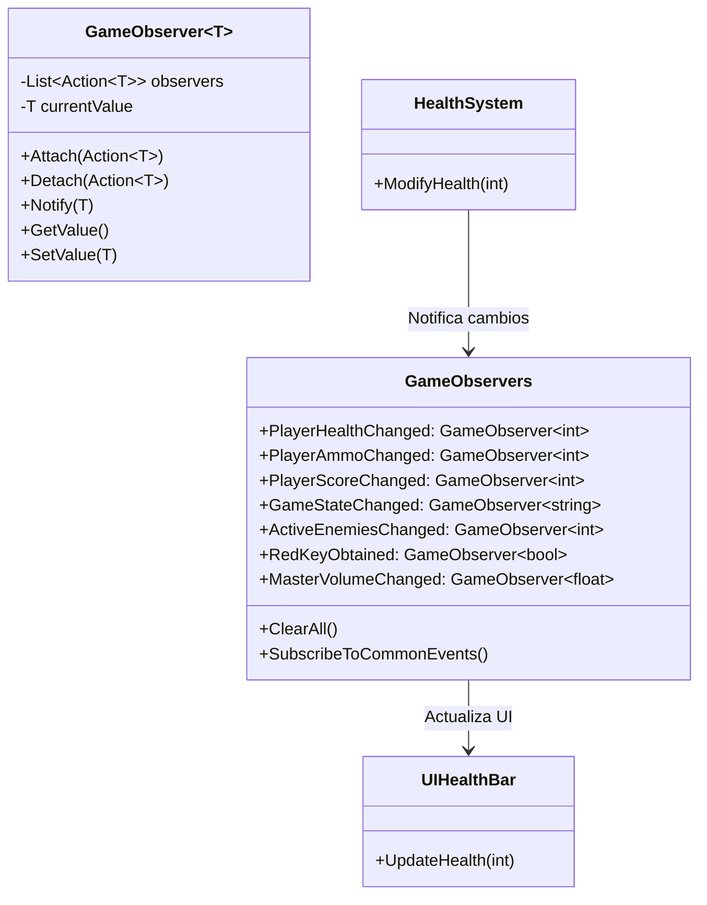

# 👁️ **Observer Pattern - Retro FPS Engine**

## 📖 **Descripción General**

El **Observer Pattern** define una relación uno-a-muchos entre objetos, donde cuando un objeto cambia de estado, todos sus dependientes son notificados automáticamente. En el Retro FPS Engine, se usa para crear un sistema reactivo donde la UI, audio, y otros sistemas responden automáticamente a cambios en el estado del juego.

## 🏗️ **Arquitectura**



## 🎯 **Uso Básico**

### **1. Suscribirse a un Observer**

```csharp
using RetroFPS;

public class UIHealthBar : MonoBehaviour
{
    [SerializeField] private Image healthFill;

    private void Start()
    {
        // Suscribirse a cambios de salud
        GameObservers.PlayerHealthChanged.Attach(UpdateHealthBar);

        // Inicializar con valor actual
        UpdateHealthBar(GameObservers.PlayerHealthChanged.GetValue());
    }

    private void UpdateHealthBar(int currentHealth)
    {
        // Actualizar barra de salud
        float fillAmount = (float)currentHealth / GlobalVariables.Instance.PlayerMaxHealth;
        healthFill.fillAmount = fillAmount;

        // Cambiar color basado en salud
        if (fillAmount < 0.3f)
            healthFill.color = Color.red;
        else if (fillAmount < 0.6f)
            healthFill.color = Color.yellow;
        else
            healthFill.color = Color.green;
    }

    private void OnDestroy()
    {
        // IMPORTANTE: Desuscribirse para evitar memory leaks
        GameObservers.PlayerHealthChanged.Detach(UpdateHealthBar);
    }
}
```

### **2. Notificar Cambios**

```csharp
using RetroFPS;

public class PlayerHealth : MonoBehaviour
{
    private int currentHealth = 100;

    public void TakeDamage(int damage)
    {
        int oldHealth = currentHealth;
        currentHealth = Mathf.Max(0, currentHealth - damage);

        // Notificar cambio automáticamente
        GameObservers.PlayerHealthChanged.SetValue(currentHealth);

        Debug.Log($"Health changed: {oldHealth} -> {currentHealth}");

        if (currentHealth <= 0)
        {
            Die();
        }
    }

    public void Heal(int amount)
    {
        int oldHealth = currentHealth;
        currentHealth = Mathf.Min(GlobalVariables.Instance.PlayerMaxHealth, currentHealth + amount);

        // Notificar cambio
        GameObservers.PlayerHealthChanged.SetValue(currentHealth);

        Debug.Log($"Health healed: {oldHealth} -> {currentHealth}");
    }

    private void Die()
    {
        GameObservers.GameStateChanged.SetValue("GameOver");
    }
}
```

### **3. Observer Personalizado**

```csharp
public class AchievementSystem : MonoBehaviour
{
    private int enemiesKilled = 0;
    private bool firstKillAchieved = false;

    private void Start()
    {
        // Suscribirse a múltiples observers
        GameObservers.TotalEnemiesKilledChanged.Attach(OnEnemyKilled);
        GameObservers.PlayerScoreChanged.Attach(OnScoreChanged);
        GameObservers.GameStateChanged.Attach(OnGameStateChanged);
    }

    private void OnEnemyKilled(int totalKilled)
    {
        if (!firstKillAchieved && totalKilled >= 1)
        {
            UnlockAchievement("First Blood!");
            firstKillAchieved = true;
        }

        if (totalKilled >= 10)
        {
            UnlockAchievement("Killing Spree!");
        }

        if (totalKilled >= 50)
        {
            UnlockAchievement("Massacre!");
        }
    }

    private void OnScoreChanged(int newScore)
    {
        if (newScore >= 10000)
        {
            UnlockAchievement("High Scorer!");
        }
    }

    private void OnGameStateChanged(string newState)
    {
        if (newState == "GameOver")
        {
            // Guardar estadísticas finales
            SaveFinalStats();
        }
    }

    private void UnlockAchievement(string achievementName)
    {
        Debug.Log($"🏆 Achievement Unlocked: {achievementName}");

        // Mostrar notificación en UI
        ShowAchievementNotification(achievementName);

        // Reproducir sonido
        PlayAchievementSound();

        // Guardar progreso
        SaveAchievementProgress(achievementName);
    }

    private void ShowAchievementNotification(string name)
    {
        // Implementar notificación UI
    }

    private void PlayAchievementSound()
    {
        // Implementar audio
    }

    private void SaveAchievementProgress(string achievement)
    {
        // Guardar en PlayerPrefs
        PlayerPrefs.SetString($"Achievement_{achievement}", "unlocked");
        PlayerPrefs.Save();
    }

    private void SaveFinalStats()
    {
        int finalScore = GameObservers.PlayerScoreChanged.GetValue();
        int enemiesKilled = GameObservers.TotalEnemiesKilledChanged.GetValue();

        Debug.Log($"Game Over - Final Score: {finalScore}, Enemies Killed: {enemiesKilled}");

        // Guardar estadísticas para leaderboards, etc.
    }
}
```

## 📋 **Observers Disponibles**

### **Player Stats**
- `PlayerHealthChanged` (int) - Salud actual del jugador
- `PlayerAmmoChanged` (int) - Munición actual
- `PlayerLivesChanged` (int) - Vidas restantes
- `PlayerScoreChanged` (int) - Puntaje actual

### **Game State**
- `GameStateChanged` (string) - Estado del juego ("Menu", "Playing", "Paused", "GameOver")
- `CurrentLevelChanged` (int) - Nivel actual
- `GameTimeChanged` (float) - Tiempo de juego transcurrido
- `GamePausedChanged` (bool) - Estado de pausa

### **Enemies & Combat**
- `ActiveEnemiesChanged` (int) - Número de enemigos activos
- `TotalEnemiesKilledChanged` (int) - Total de enemigos asesinados

### **Inventory & Items**
- `InventoryItemsChanged` (int) - Número de items en inventario
- `ItemEquipped` (string) - Item equipado
- `ItemUsed` (string) - Item usado

### **Keys & Progression**
- `RedKeyObtained` (bool) - Llave roja obtenida
- `BlueKeyObtained` (bool) - Llave azul obtenida
- `YellowKeyObtained` (bool) - Llave amarilla obtenida
- `DoorOpened` (string) - Puerta abierta

### **Audio**
- `MasterVolumeChanged` (float) - Volumen master (0-1)
- `SFXVolumeChanged` (float) - Volumen efectos (0-1)
- `MusicVolumeChanged` (float) - Volumen música (0-1)
- `CurrentMusicChanged` (string) - Música actual

### **Performance**
- `CurrentFPSChanged` (int) - FPS actuales
- `MemoryUsageChanged` (float) - Uso de memoria en MB

## 🎮 **Casos de Uso Avanzados**

### **Sistema de UI Reactiva Completo**

```csharp
public class GameUIManager : MonoBehaviour
{
    [Header("UI References")]
    [SerializeField] private TextMeshProUGUI healthText;
    [SerializeField] private TextMeshProUGUI ammoText;
    [SerializeField] private TextMeshProUGUI scoreText;
    [SerializeField] private TextMeshProUGUI levelText;
    [SerializeField] private GameObject pauseMenu;
    [SerializeField] private GameObject gameOverMenu;

    private void Start()
    {
        // Suscribirse a todos los observers relevantes
        SubscribeToAllObservers();
        UpdateAllUI(); // Inicializar UI
    }

    private void SubscribeToAllObservers()
    {
        // Player stats
        GameObservers.PlayerHealthChanged.Attach(UpdateHealthUI);
        GameObservers.PlayerAmmoChanged.Attach(UpdateAmmoUI);
        GameObservers.PlayerScoreChanged.Attach(UpdateScoreUI);

        // Game state
        GameObservers.CurrentLevelChanged.Attach(UpdateLevelUI);
        GameObservers.GamePausedChanged.Attach(UpdatePauseUI);
        GameObservers.GameStateChanged.Attach(UpdateGameStateUI);

        // Audio
        GameObservers.MasterVolumeChanged.Attach(UpdateAudioSettings);
    }

    private void UpdateAllUI()
    {
        UpdateHealthUI(GameObservers.PlayerHealthChanged.GetValue());
        UpdateAmmoUI(GameObservers.PlayerAmmoChanged.GetValue());
        UpdateScoreUI(GameObservers.PlayerScoreChanged.GetValue());
        UpdateLevelUI(GameObservers.CurrentLevelChanged.GetValue());
        UpdatePauseUI(GameObservers.GamePausedChanged.GetValue());
        UpdateGameStateUI(GameObservers.GameStateChanged.GetValue());
    }

    private void UpdateHealthUI(int health)
    {
        healthText.text = $"Health: {health}/{GlobalVariables.Instance.PlayerMaxHealth}";
        healthText.color = health < 25 ? Color.red : Color.white;
    }

    private void UpdateAmmoUI(int ammo)
    {
        ammoText.text = $"Ammo: {ammo}/{GlobalVariables.Instance.PlayerMaxAmmo}";
    }

    private void UpdateScoreUI(int score)
    {
        scoreText.text = $"Score: {score.ToString("N0")}";
    }

    private void UpdateLevelUI(int level)
    {
        levelText.text = $"Level {level}";
    }

    private void UpdatePauseUI(bool isPaused)
    {
        pauseMenu.SetActive(isPaused);
        Time.timeScale = isPaused ? 0f : 1f;
    }

    private void UpdateGameStateUI(string state)
    {
        // Ocultar todos los menús primero
        pauseMenu.SetActive(false);
        gameOverMenu.SetActive(false);

        switch (state)
        {
            case "Playing":
                // Mostrar HUD del juego
                break;
            case "Paused":
                pauseMenu.SetActive(true);
                break;
            case "GameOver":
                gameOverMenu.SetActive(true);
                break;
        }
    }

    private void UpdateAudioSettings(float masterVolume)
    {
        // Actualizar AudioMixer con el nuevo volumen
        AudioListener.volume = masterVolume;
    }
}
```

### **Sistema de Guardado Automático**

```csharp
public class AutoSaveSystem : MonoBehaviour
{
    [SerializeField] private float saveInterval = 30f; // Guardar cada 30 segundos
    private float lastSaveTime;

    private void Start()
    {
        // Suscribirse a eventos importantes para guardar inmediatamente
        GameObservers.PlayerScoreChanged.Attach(_ => SaveGame());
        GameObservers.CurrentLevelChanged.Attach(_ => SaveGame());
        GameObservers.GameStateChanged.Attach(state => {
            if (state == "GameOver") SaveGame();
        });
    }

    private void Update()
    {
        // Guardado automático periódico
        if (Time.time - lastSaveTime >= saveInterval)
        {
            SaveGame();
            lastSaveTime = Time.time;
        }
    }

    private void SaveGame()
    {
        // Guardar usando GlobalVariables
        GlobalVariables.Instance.SaveToPlayerPrefs();

        // Guardar estadísticas adicionales
        SaveStatistics();

        Debug.Log("Game auto-saved");
    }

    private void SaveStatistics()
    {
        // Guardar estadísticas de la sesión actual
        int sessionScore = GameObservers.PlayerScoreChanged.GetValue();
        int sessionEnemies = GameObservers.TotalEnemiesKilledChanged.GetValue();
        float sessionTime = GameObservers.GameTimeChanged.GetValue();

        PlayerPrefs.SetInt("LastSessionScore", sessionScore);
        PlayerPrefs.SetInt("LastSessionEnemies", sessionEnemies);
        PlayerPrefs.SetFloat("LastSessionTime", sessionTime);
        PlayerPrefs.Save();
    }
}
```

### **Sistema de Analytics**

```csharp
public class GameAnalytics : MonoBehaviour
{
    private void Start()
    {
        // Suscribirse a eventos para analytics
        GameObservers.PlayerHealthChanged.Attach(TrackHealthEvents);
        GameObservers.PlayerDiedEvent.Subscribe(TrackPlayerDeath);
        GameObservers.EnemyKilledEvent.Subscribe(TrackEnemyKill);
        GameObservers.LevelCompletedEvent.Subscribe(TrackLevelCompletion);
    }

    private void TrackHealthEvents(int health)
    {
        // Track health changes
        Analytics.CustomEvent("health_changed", new Dictionary<string, object> {
            { "current_health", health },
            { "max_health", GlobalVariables.Instance.PlayerMaxHealth }
        });
    }

    private void TrackPlayerDeath(PlayerDiedEvent evt)
    {
        Analytics.CustomEvent("player_death", new Dictionary<string, object> {
            { "death_position", evt.DeathPosition.ToString() },
            { "cause_of_death", evt.CauseOfDeath },
            { "final_score", GameObservers.PlayerScoreChanged.GetValue() }
        });
    }

    private void TrackEnemyKill(EnemyKilledEvent evt)
    {
        Analytics.CustomEvent("enemy_killed", new Dictionary<string, object> {
            { "enemy_type", evt.EnemyType },
            { "kill_position", evt.DeathPosition.ToString() },
            { "score_value", evt.ScoreValue }
        });
    }

    private void TrackLevelCompletion(LevelCompletedEvent evt)
    {
        Analytics.CustomEvent("level_completed", new Dictionary<string, object> {
            { "level_name", evt.LevelName },
            { "completion_time", evt.CompletionTime },
            { "score", evt.Score }
        });
    }
}
```

### **Sistema de Cheats/Debug**

```csharp
public class DebugCheats : MonoBehaviour
{
    private void Update()
    {
        // Cheats activados con Ctrl+Shift+letra
        if (Input.GetKey(KeyCode.LeftControl) && Input.GetKey(KeyCode.LeftShift))
        {
            if (Input.GetKeyDown(KeyCode.H))
            {
                // God mode health
                GameObservers.PlayerHealthChanged.SetValue(999);
                Debug.Log("God mode activated!");
            }

            if (Input.GetKeyDown(KeyCode.A))
            {
                // Infinite ammo
                GameObservers.PlayerAmmoChanged.SetValue(999);
                Debug.Log("Infinite ammo activated!");
            }

            if (Input.GetKeyDown(KeyCode.S))
            {
                // Max score
                GameObservers.PlayerScoreChanged.SetValue(999999);
                Debug.Log("Max score set!");
            }
        }

        // Debug info con F12
        if (Input.GetKeyDown(KeyCode.F12))
        {
            PrintDebugInfo();
        }
    }

    private void PrintDebugInfo()
    {
        string info = "=== DEBUG INFO ===\n";
        info += $"Health: {GameObservers.PlayerHealthChanged.GetValue()}\n";
        info += $"Ammo: {GameObservers.PlayerAmmoChanged.GetValue()}\n";
        info += $"Score: {GameObservers.PlayerScoreChanged.GetValue()}\n";
        info += $"Level: {GameObservers.CurrentLevelChanged.GetValue()}\n";
        info += $"Enemies: {GameObservers.ActiveEnemiesChanged.GetValue()}\n";
        info += $"Game State: {GameObservers.GameStateChanged.GetValue()}\n";

        Debug.Log(info);
    }
}
```

## 🔧 **Características Avanzadas**

### **Observer Extensions**

```csharp
public static class ObserverExtensions
{
    /// <summary>
    /// Suscripción con lambda simplificada
    /// </summary>
    public static void Subscribe<T>(this GameObserver<T> observer, System.Action<T> callback)
    {
        observer.Attach(callback);
    }

    /// <summary>
    /// Actualización simplificada
    /// </summary>
    public static void Update<T>(this GameObserver<T> observer, T value)
    {
        observer.SetValue(value);
    }

    /// <summary>
    /// Suscripción condicional
    /// </summary>
    public static void SubscribeWhen<T>(this GameObserver<T> observer,
                                       System.Action<T> callback,
                                       System.Func<T, bool> condition)
    {
        observer.Attach(value => {
            if (condition(value)) callback(value);
        });
    }

    /// <summary>
    /// Suscripción con throttling (evita llamadas muy frecuentes)
    /// </summary>
    public static void SubscribeThrottled<T>(this GameObserver<T> observer,
                                            System.Action<T> callback,
                                            float throttleTime = 0.1f)
    {
        float lastCallTime = 0f;
        observer.Attach(value => {
            if (Time.time - lastCallTime >= throttleTime)
            {
                callback(value);
                lastCallTime = Time.time;
            }
        });
    }
}
```

### **Observer Groups**

```csharp
public class ObserverGroup
{
    private List<System.IDisposable> subscriptions = new List<System.IDisposable>();

    public void Add<T>(GameObserver<T> observer, System.Action<T> callback)
    {
        observer.Attach(callback);
        subscriptions.Add(new ObserverSubscription<T>(observer, callback));
    }

    public void Clear()
    {
        foreach (var sub in subscriptions)
        {
            sub.Dispose();
        }
        subscriptions.Clear();
    }

    private class ObserverSubscription<T> : System.IDisposable
    {
        private GameObserver<T> observer;
        private System.Action<T> callback;

        public ObserverSubscription(GameObserver<T> obs, System.Action<T> cb)
        {
            observer = obs;
            callback = cb;
        }

        public void Dispose()
        {
            observer.Detach(callback);
        }
    }
}

// Uso
public class ComplexUI : MonoBehaviour
{
    private ObserverGroup uiObservers = new ObserverGroup();

    private void Start()
    {
        // Agrupar suscripciones relacionadas
        uiObservers.Add(GameObservers.PlayerHealthChanged, UpdateHealth);
        uiObservers.Add(GameObservers.PlayerAmmoChanged, UpdateAmmo);
        uiObservers.Add(GameObservers.PlayerScoreChanged, UpdateScore);
    }

    private void OnDestroy()
    {
        // Limpiar todas las suscripciones automáticamente
        uiObservers.Clear();
    }
}
```

### **Observer con Historial**

```csharp
public class HistoricalObserver<T> : GameObserver<T>
{
    private List<(float timestamp, T value)> history = new List<(float, T)>();
    private int maxHistorySize = 100;

    public override void SetValue(T newValue)
    {
        // Guardar en historial antes de cambiar
        history.Add((Time.time, GetValue()));

        // Limitar tamaño del historial
        if (history.Count > maxHistorySize)
        {
            history.RemoveAt(0);
        }

        base.SetValue(newValue);
    }

    public T GetValueAtTime(float timestamp)
    {
        // Encontrar valor más cercano al timestamp
        for (int i = history.Count - 1; i >= 0; i--)
        {
            if (history[i].timestamp <= timestamp)
            {
                return history[i].value;
            }
        }

        return GetValue(); // Retornar valor actual si no hay historial
    }

    public void ClearHistory()
    {
        history.Clear();
    }

    public string GetHistoryDebugInfo()
    {
        string info = $"History ({history.Count} entries):\n";
        foreach (var entry in history)
        {
            info += $"{entry.timestamp:F2}s: {entry.value}\n";
        }
        return info;
    }
}
```

## 🔗 **Integración con Otros Patrones**

### **Con Event Bus**

```csharp
// Los observers pueden suscribirse a eventos del EventBus
public class EventToObserverBridge : MonoBehaviour
{
    private void Start()
    {
        // Conectar EventBus con GameObservers
        EventBus.Subscribe<PlayerHealthChangedEvent>(evt => {
            GameObservers.PlayerHealthChanged.SetValue(evt.NewHealth);
        });

        EventBus.Subscribe<EnemyKilledEvent>(evt => {
            GameObservers.TotalEnemiesKilledChanged.ModifyValue(count => count + 1);
        });
    }
}
```

### **Con Command Pattern**

```csharp
public class ObservableCommand : InteractableCommand
{
    public override void Execute()
    {
        base.Execute();

        // Notificar a observers después de ejecutar
        GameObservers.PlayerInteracted.UpdateValue(targetObject.name);
    }
}
```

## 🧪 **Testing**

```csharp
[Test]
public void GameObserver_NotifiesSubscribers()
{
    // Arrange
    var observer = new GameObserver<int>(0);
    int receivedValue = -1;

    observer.Attach(value => receivedValue = value);

    // Act
    observer.SetValue(42);

    // Assert
    Assert.AreEqual(42, receivedValue);
    Assert.AreEqual(42, observer.GetValue());
}

[Test]
public void GameObservers_GlobalObservers_Work()
{
    // Arrange
    int healthValue = -1;
    GameObservers.PlayerHealthChanged.Attach(value => healthValue = value);

    // Act
    GameObservers.PlayerHealthChanged.SetValue(75);

    // Assert
    Assert.AreEqual(75, healthValue);
    Assert.AreEqual(75, GameObservers.PlayerHealthChanged.GetValue());
}

[Test]
public void GameObserver_ModifyValue_Works()
{
    // Arrange
    var observer = new GameObserver<int>(10);

    // Act
    observer.ModifyValue(value => value * 2);

    // Assert
    Assert.AreEqual(20, observer.GetValue());
}
```

## ⚡ **Performance**

### **Optimizaciones**
- **Lazy Initialization**: Los observers se crean solo cuando se usan
- **Efficient Notification**: Iteración directa sobre listas
- **Minimal Allocations**: Reutilización de objetos
- **Throttling Support**: Evita notificaciones excesivas

### **Recomendaciones**
- **Throttling**: Para observers que cambian frecuentemente
- **Unsubscription**: Siempre desuscribirse en OnDestroy
- **Batching**: Agrupar múltiples cambios en una notificación
- **Threading**: Los observers no son thread-safe

## 🚨 **Consideraciones Importantes**

### **Memory Leaks**

```csharp
// ❌ MAL: No desuscribirse
public class BadObserverExample : MonoBehaviour
{
    void Start()
    {
        GameObservers.PlayerHealthChanged.Attach(UpdateUI);
        // Si este objeto se destruye, el callback queda registrado
    }

    void UpdateUI(int health) { /* ... */ }
}

// ✅ BIEN: Desuscribirse correctamente
public class GoodObserverExample : MonoBehaviour
{
    void Start()
    {
        GameObservers.PlayerHealthChanged.Attach(UpdateUI);
    }

    void OnDestroy()
    {
        GameObservers.PlayerHealthChanged.Detach(UpdateUI);
    }

    void UpdateUI(int health) { /* ... */ }
}
```

### **Infinite Loops**

```csharp
// ❌ MAL: Loop infinito
public class InfiniteLoopExample : MonoBehaviour
{
    void Start()
    {
        GameObservers.PlayerHealthChanged.Attach(health => {
            // Esto causa loop infinito
            GameObservers.PlayerHealthChanged.SetValue(health + 1);
        });
    }
}

// ✅ BIEN: Evitar modificaciones recursivas
public class SafeObserverExample : MonoBehaviour
{
    private bool isUpdating = false;

    void Start()
    {
        GameObservers.PlayerHealthChanged.Attach(UpdateSafely);
    }

    void UpdateSafely(int health)
    {
        if (isUpdating) return;

        isUpdating = true;
        // Modificar otros observers, no este mismo
        GameObservers.PlayerScoreChanged.SetValue(health * 10);
        isUpdating = false;
    }
}
```

### **Observer Dependencies**

```csharp
// ✅ MANEJAR DEPENDENCIAS
public class DependentObservers : MonoBehaviour
{
    void Start()
    {
        // Observer A depende de Observer B
        GameObservers.PlayerHealthChanged.Attach(health => {
            // Este observer modifica otro observer
            if (health <= 0)
            {
                GameObservers.GameStateChanged.SetValue("GameOver");
            }
        });

        // Asegurar orden de ejecución si es necesario
        // Los observers se ejecutan en orden de suscripción
    }
}
```

## 📚 **Referencias**

- [Observer Pattern](https://en.wikipedia.org/wiki/Observer_pattern)
- [Reactive Programming](https://en.wikipedia.org/wiki/Reactive_programming)
- [Unity Events vs Observers](https://docs.unity3d.com/ScriptReference/Events.UnityEvent.html)

---

**Archivos**: `Observer/GameObserver.cs`, `Observer/GameObservers.cs`
**Versión**: 1.0
**Última actualización**: Enero 2026
