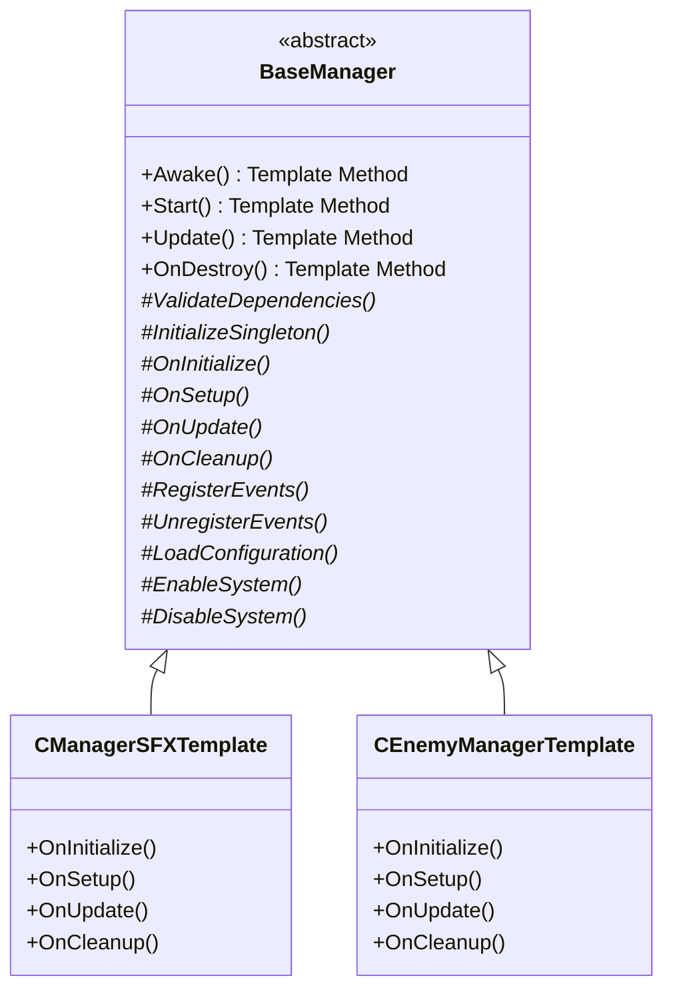

# 📐 **Template Method Pattern - Retro FPS Engine**

## 📖 **Descripción General**

El **Template Method Pattern** define el esqueleto de un algoritmo en una clase base, permitiendo que las subclases sobrescriban pasos específicos sin cambiar la estructura general. En el Retro FPS Engine, se usa para estandarizar el ciclo de vida de managers y componentes.

## 🏗️ **Arquitectura**



## 🎯 **Uso Básico**

### **1. Crear un Manager Personalizado**

```csharp
using RetroFPS;

public class MyCustomManager : BaseManager
{
    // Variables específicas del manager
    [SerializeField] private int customValue = 42;
    [SerializeField] private GameObject customPrefab;

    // ============================================
    // IMPLEMENTACIÓN DE MÉTODOS ABSTRACTOS
    // ============================================

    protected override void OnInitialize()
    {
        // Inicialización específica
        Debug.Log($"MyCustomManager initialized with value: {customValue}");

        // Validar prefab
        if (customPrefab == null)
        {
            Debug.LogWarning("Custom prefab not set!");
        }
    }

    protected override void OnSetup()
    {
        // Setup específico después de que todos los objetos están inicializados
        Debug.Log("MyCustomManager setup completed");

        // Configurar referencias, suscribirse a eventos, etc.
    }

    protected override void OnUpdate()
    {
        // Lógica específica que se ejecuta cada frame
        if (Input.GetKeyDown(KeyCode.Space))
        {
            DoCustomAction();
        }
    }

    protected override void OnCleanup()
    {
        // Limpieza específica
        Debug.Log("MyCustomManager cleanup");

        // Limpiar referencias, cancelar suscripciones, etc.
    }

    // ============================================
    // MÉTODOS PERSONALIZADOS
    // ============================================

    private void DoCustomAction()
    {
        Debug.Log($"Custom action performed with value: {customValue}");

        if (customPrefab != null)
        {
            Instantiate(customPrefab, transform.position, Quaternion.identity);
        }
    }

    // Método público para uso externo
    public void SetCustomValue(int value)
    {
        customValue = value;
        Debug.Log($"Custom value changed to: {value}");
    }
}
```

### **2. Personalizar Hooks Virtuales**

```csharp
using RetroFPS;

public class AdvancedManager : BaseManager
{
    protected override bool ValidateDependencies()
    {
        // Validación personalizada
        if (FindObjectOfType<RequiredComponent>() == null)
        {
            Debug.LogError("RequiredComponent not found in scene!");
            return false;
        }

        return base.ValidateDependencies(); // Llamar a validación base
    }

    protected override void RegisterEvents()
    {
        // Registro personalizado de eventos
        EventBus.Subscribe<PlayerHealthChangedEvent>(OnPlayerHealthChanged);

        base.RegisterEvents(); // Registrar eventos base si existen
    }

    protected override void UnregisterEvents()
    {
        // Limpieza personalizada de eventos
        EventBus.Unsubscribe<PlayerHealthChangedEvent>(OnPlayerHealthChanged);

        base.UnregisterEvents();
    }

    protected override void LoadConfiguration()
    {
        // Cargar configuración específica
        customSetting = PlayerPrefs.GetInt("MyManager_CustomSetting", 10);

        base.LoadConfiguration();
    }

    protected override bool ShouldRunPeriodicChecks()
    {
        // Ejecutar verificaciones cada 10 frames en lugar de cada frame
        return Time.frameCount % 10 == 0;
    }

    protected override void PerformPeriodicChecks()
    {
        // Verificaciones personalizadas
        CheckNetworkConnection();
        ValidatePerformanceMetrics();
    }

    // Variables privadas
    private int customSetting;

    // Métodos de eventos
    private void OnPlayerHealthChanged(PlayerHealthChangedEvent evt)
    {
        Debug.Log($"Manager notified of health change: {evt.NewHealth}");
    }

    private void CheckNetworkConnection()
    {
        // Verificar conexión de red periódicamente
    }

    private void ValidatePerformanceMetrics()
    {
        // Validar métricas de rendimiento
    }
}
```

### **3. Manager con Singleton**

```csharp
using RetroFPS;

public class SingletonManager : BaseManager
{
    public static SingletonManager Instance { get; private set; }

    protected override void OnInitialize()
    {
        Debug.Log("SingletonManager initialized");
    }

    protected override void OnSetup()
    {
        Debug.Log("SingletonManager setup");
    }

    protected override void OnUpdate()
    {
        // Lógica singleton
    }

    protected override void OnCleanup()
    {
        Debug.Log("SingletonManager cleanup");
    }

    protected override void InitializeSingleton()
    {
        if (Instance != null && Instance != this)
        {
            Destroy(gameObject);
            return;
        }

        Instance = this;
        DontDestroyOnLoad(gameObject);
        Debug.Log("Singleton initialized");
    }

    protected override void CleanupSingleton()
    {
        if (Instance == this)
        {
            Instance = null;
            Debug.Log("Singleton cleaned up");
        }
    }

    // Método público estático para acceso fácil
    public static void DoSingletonAction()
    {
        if (Instance != null)
        {
            Instance.PerformAction();
        }
    }

    private void PerformAction()
    {
        Debug.Log("Singleton action performed");
    }
}
```

## 📋 **Implementaciones Incluidas**

### **CManagerSFXTemplate**

Manager de efectos de sonido que demuestra el uso del Template Method:

```csharp
public class CManagerSFXTemplate : BaseManager
{
    // Implementa OnInitialize, OnSetup, OnUpdate, OnCleanup
    // Maneja pooling de AudioSources, configuración de volumen, etc.
}
```

### **CEnemyManagerTemplate**

Manager de enemigos que usa el patrón para gestionar spawning y AI:

```csharp
public class CEnemyManagerTemplate : BaseManager
{
    // Implementa OnInitialize, OnSetup, OnUpdate, OnCleanup
    // Maneja pools de enemigos, dificultad, estadísticas, etc.
}
```

## 🎮 **Casos de Uso Avanzados**

### **Manager de UI con Transiciones**

```csharp
using RetroFPS;

public class UIManager : BaseManager
{
    [SerializeField] private CanvasGroup mainMenu;
    [SerializeField] private CanvasGroup gameUI;
    [SerializeField] private CanvasGroup pauseMenu;

    private enum UIState { MainMenu, Game, Paused }
    private UIState currentState;

    protected override void OnInitialize()
    {
        // Inicializar estado de UI
        SetUIState(UIState.MainMenu);
    }

    protected override void OnSetup()
    {
        // Suscribirse a cambios de estado del juego
        GameObservers.GameStateChanged.Attach(OnGameStateChanged);
        GameObservers.GamePausedChanged.Attach(OnGamePausedChanged);
    }

    protected override void OnUpdate()
    {
        // Manejar input de UI
        HandleUIInput();
    }

    protected override void OnCleanup()
    {
        // Desuscribirse de observers
        GameObservers.GameStateChanged.Detach(OnGameStateChanged);
        GameObservers.GamePausedChanged.Detach(OnGamePausedChanged);
    }

    protected override void RegisterEvents()
    {
        // Registrar eventos de UI
        EventBus.Subscribe<UIOpenedEvent>(OnUIOpened);
        EventBus.Subscribe<UIClosedEvent>(OnUIClosed);
    }

    protected override void UnregisterEvents()
    {
        EventBus.Unsubscribe<UIOpenedEvent>(OnUIOpened);
        EventBus.Unsubscribe<UIClosedEvent>(OnUIClosed);
    }

    private void SetUIState(UIState newState)
    {
        currentState = newState;

        // Ocultar todos los menús
        SetCanvasGroupAlpha(mainMenu, 0f);
        SetCanvasGroupAlpha(gameUI, 0f);
        SetCanvasGroupAlpha(pauseMenu, 0f);

        // Mostrar menú activo
        switch (newState)
        {
            case UIState.MainMenu:
                SetCanvasGroupAlpha(mainMenu, 1f);
                break;
            case UIState.Game:
                SetCanvasGroupAlpha(gameUI, 1f);
                break;
            case UIState.Paused:
                SetCanvasGroupAlpha(pauseMenu, 1f);
                break;
        }
    }

    private void OnGameStateChanged(string state)
    {
        switch (state)
        {
            case "MainMenu":
                SetUIState(UIState.MainMenu);
                break;
            case "Playing":
                SetUIState(UIState.Game);
                break;
            case "GameOver":
                SetUIState(UIState.MainMenu); // O mostrar game over screen
                break;
        }
    }

    private void OnGamePausedChanged(bool paused)
    {
        if (paused)
        {
            SetUIState(UIState.Paused);
        }
        else if (currentState == UIState.Paused)
        {
            SetUIState(UIState.Game);
        }
    }

    private void HandleUIInput()
    {
        if (Input.GetKeyDown(KeyCode.Escape))
        {
            if (currentState == UIState.Game)
            {
                GameObservers.GamePausedChanged.SetValue(true);
            }
            else if (currentState == UIState.Paused)
            {
                GameObservers.GamePausedChanged.SetValue(false);
            }
        }
    }

    private void SetCanvasGroupAlpha(CanvasGroup group, float alpha)
    {
        if (group != null)
        {
            group.alpha = alpha;
            group.interactable = alpha > 0.5f;
            group.blocksRaycasts = alpha > 0.5f;
        }
    }
}
```

### **Manager de Save/Load**

```csharp
using RetroFPS;

public class SaveLoadManager : BaseManager
{
    [SerializeField] private float autoSaveInterval = 60f; // 1 minuto
    private float lastSaveTime;

    protected override void OnInitialize()
    {
        // Preparar sistema de guardado
        EnsureSaveDirectoryExists();
    }

    protected override void OnSetup()
    {
        // Cargar partida guardada automáticamente
        LoadGame();
    }

    protected override void OnUpdate()
    {
        // Auto-guardado periódico
        if (Time.time - lastSaveTime >= autoSaveInterval)
        {
            AutoSave();
        }

        // Guardado manual
        if (Input.GetKeyDown(KeyCode.F5))
        {
            SaveGame();
        }

        // Carga manual
        if (Input.GetKeyDown(KeyCode.F9))
        {
            LoadGame();
        }
    }

    protected override void OnCleanup()
    {
        // Guardado final al salir
        SaveGame();
    }

    protected override void LoadConfiguration()
    {
        // Cargar configuración de guardado
        autoSaveInterval = PlayerPrefs.GetFloat("AutoSaveInterval", 60f);
    }

    protected override bool ShouldRunPeriodicChecks()
    {
        return true;
    }

    protected override void PerformPeriodicChecks()
    {
        // Verificar integridad de archivos de guardado
        ValidateSaveFiles();
    }

    private void AutoSave()
    {
        SaveGame("auto");
        lastSaveTime = Time.time;
        Debug.Log("Auto-saved game");
    }

    private void SaveGame(string slot = "manual")
    {
        try
        {
            // Recopilar datos de guardado
            SaveData data = new SaveData
            {
                playerHealth = GlobalVariables.Instance.PlayerHealth,
                playerScore = GlobalVariables.Instance.PlayerScore,
                currentLevel = GlobalVariables.Instance.CurrentLevel,
                gameTime = GlobalVariables.Instance.GameTime
            };

            // Serializar y guardar
            string json = JsonUtility.ToJson(data);
            string filePath = GetSaveFilePath(slot);
            System.IO.File.WriteAllText(filePath, json);

            Debug.Log($"Game saved to slot: {slot}");
        }
        catch (System.Exception ex)
        {
            Debug.LogError($"Failed to save game: {ex.Message}");
        }
    }

    private void LoadGame(string slot = "manual")
    {
        try
        {
            string filePath = GetSaveFilePath(slot);
            if (System.IO.File.Exists(filePath))
            {
                string json = System.IO.File.ReadAllText(filePath);
                SaveData data = JsonUtility.FromJson<SaveData>(json);

                // Aplicar datos cargados
                GlobalVariables.Instance.ModifyHealth(data.playerHealth - GlobalVariables.Instance.PlayerHealth);
                // Actualizar otros sistemas...

                Debug.Log($"Game loaded from slot: {slot}");
            }
        }
        catch (System.Exception ex)
        {
            Debug.LogError($"Failed to load game: {ex.Message}");
        }
    }

    private string GetSaveFilePath(string slot)
    {
        return System.IO.Path.Combine(Application.persistentDataPath, $"save_{slot}.json");
    }

    private void EnsureSaveDirectoryExists()
    {
        string dir = Application.persistentDataPath;
        if (!System.IO.Directory.Exists(dir))
        {
            System.IO.Directory.CreateDirectory(dir);
        }
    }

    private void ValidateSaveFiles()
    {
        // Verificar que los archivos de guardado sean válidos
        // Eliminar archivos corruptos, etc.
    }

    [System.Serializable]
    private class SaveData
    {
        public int playerHealth;
        public int playerScore;
        public int currentLevel;
        public float gameTime;
    }
}
```

### **Manager de Red con Template Method**

```csharp
using RetroFPS;

public class NetworkManager : BaseManager
{
    [SerializeField] private string serverAddress = "localhost";
    [SerializeField] private int serverPort = 7777;
    [SerializeField] private float connectionTimeout = 10f;

    private enum ConnectionState { Disconnected, Connecting, Connected, Error }
    private ConnectionState connectionState = ConnectionState.Disconnected;

    protected override void OnInitialize()
    {
        // Inicializar networking
        InitializeNetworking();
    }

    protected override void OnSetup()
    {
        // Intentar conexión automática si está configurado
        if (PlayerPrefs.GetInt("AutoConnect", 0) == 1)
        {
            ConnectToServer();
        }
    }

    protected override void OnUpdate()
    {
        // Procesar mensajes de red
        ProcessNetworkMessages();

        // Verificar estado de conexión
        UpdateConnectionState();
    }

    protected override void OnCleanup()
    {
        // Desconectar limpiamente
        DisconnectFromServer();
    }

    protected override bool ShouldRunPeriodicChecks()
    {
        return connectionState == ConnectionState.Connected;
    }

    protected override void PerformPeriodicChecks()
    {
        // Ping al servidor, verificar latencia, etc.
        SendHeartbeat();
    }

    protected override void LoadConfiguration()
    {
        serverAddress = PlayerPrefs.GetString("ServerAddress", serverAddress);
        serverPort = PlayerPrefs.GetInt("ServerPort", serverPort);
    }

    public void ConnectToServer()
    {
        if (connectionState != ConnectionState.Disconnected)
        {
            Debug.LogWarning("Already connected or connecting");
            return;
        }

        connectionState = ConnectionState.Connecting;
        Debug.Log($"Connecting to {serverAddress}:{serverPort}");

        // Iniciar conexión asíncrona
        StartCoroutine(ConnectAsync());
    }

    public void DisconnectFromServer()
    {
        if (connectionState == ConnectionState.Connected)
        {
            // Enviar mensaje de desconexión
            SendDisconnectMessage();

            connectionState = ConnectionState.Disconnected;
            Debug.Log("Disconnected from server");
        }
    }

    private System.Collections.IEnumerator ConnectAsync()
    {
        // Simular conexión (reemplazar con lógica real de red)
        float elapsed = 0f;

        while (elapsed < connectionTimeout)
        {
            elapsed += Time.deltaTime;

            // Simular progreso de conexión
            float progress = elapsed / connectionTimeout;

            if (progress >= 0.5f && Random.value > 0.9f) // 10% chance de fallo
            {
                connectionState = ConnectionState.Error;
                Debug.LogError("Connection failed!");
                yield break;
            }

            yield return null;
        }

        connectionState = ConnectionState.Connected;
        Debug.Log("Connected to server successfully!");
    }

    private void ProcessNetworkMessages()
    {
        // Procesar mensajes entrantes
        // Esto sería específico de la implementación de red
    }

    private void UpdateConnectionState()
    {
        // Actualizar indicadores de conexión en UI, etc.
        GameObservers.NetworkConnectionChanged?.SetValue(connectionState.ToString());
    }

    private void SendHeartbeat()
    {
        // Enviar ping al servidor
    }

    private void SendDisconnectMessage()
    {
        // Enviar mensaje de desconexión
    }

    private void InitializeNetworking()
    {
        // Inicializar sockets, buffers, etc.
        Debug.Log("Network system initialized");
    }
}
```

## 🔧 **Características Avanzadas**

### **Template Method con Estado**

```csharp
public abstract class StatefulBaseManager : BaseManager
{
    protected enum ManagerState { Uninitialized, Initializing, Ready, Running, Pausing, Paused, Stopping, Stopped, Error }

    protected ManagerState CurrentState { get; private set; } = ManagerState.Uninitialized;

    protected override void Awake()
    {
        SetState(ManagerState.Initializing);
        base.Awake();
        SetState(ManagerState.Ready);
    }

    protected override void Start()
    {
        SetState(ManagerState.Running);
        base.Start();
    }

    protected override void OnDestroy()
    {
        SetState(ManagerState.Stopping);
        base.OnDestroy();
        SetState(ManagerState.Stopped);
    }

    protected void SetState(ManagerState newState)
    {
        ManagerState oldState = CurrentState;
        CurrentState = newState;

        OnStateChanged(oldState, newState);
        GameObservers.ManagerStateChanged?.SetValue($"{GetType().Name}:{newState}");
    }

    protected virtual void OnStateChanged(ManagerState oldState, ManagerState newState)
    {
        // Hook para cambios de estado
        LogDebug($"State changed: {oldState} -> {newState}");
    }

    // Validaciones de estado
    protected bool IsInState(params ManagerState[] states)
    {
        foreach (var state in states)
        {
            if (CurrentState == state) return true;
        }
        return false;
    }

    protected void RequireState(ManagerState requiredState, string action)
    {
        if (CurrentState != requiredState)
        {
            throw new System.InvalidOperationException(
                $"{GetType().Name}: Cannot {action} in state {CurrentState}. Required: {requiredState}");
        }
    }
}
```

### **Template Method con Logging Extendido**

```csharp
public abstract class LoggedBaseManager : BaseManager
{
    [SerializeField] private bool enableDetailedLogging = false;
    [SerializeField] private string logPrefix = "";

    private System.Diagnostics.Stopwatch performanceTimer = new System.Diagnostics.Stopwatch();

    protected override void Awake()
    {
        if (enableDetailedLogging) LogMethodEntry("Awake");
        performanceTimer.Start();

        base.Awake();

        performanceTimer.Stop();
        if (enableDetailedLogging) LogMethodExit("Awake", performanceTimer.ElapsedMilliseconds);
    }

    protected override void Start()
    {
        if (enableDetailedLogging) LogMethodEntry("Start");
        performanceTimer.Restart();

        base.Start();

        performanceTimer.Stop();
        if (enableDetailedLogging) LogMethodExit("Start", performanceTimer.ElapsedMilliseconds);
    }

    protected override void Update()
    {
        // No loggear Update por performance, solo en casos especiales
        base.Update();
    }

    protected override void OnDestroy()
    {
        if (enableDetailedLogging) LogMethodEntry("OnDestroy");
        performanceTimer.Restart();

        base.OnDestroy();

        performanceTimer.Stop();
        if (enableDetailedLogging) LogMethodExit("OnDestroy", performanceTimer.ElapsedMilliseconds);
    }

    protected void LogMethodEntry(string methodName)
    {
        Debug.Log($"[{logPrefix}{GetType().Name}] Entering {methodName}");
    }

    protected void LogMethodExit(string methodName, long executionTimeMs = -1)
    {
        string timeInfo = executionTimeMs >= 0 ? $" ({executionTimeMs}ms)" : "";
        Debug.Log($"[{logPrefix}{GetType().Name}] Exiting {methodName}{timeInfo}");
    }

    protected void LogPerformance(string operation, long timeMs)
    {
        if (enableDetailedLogging)
        {
            Debug.Log($"[{logPrefix}{GetType().Name}] {operation} took {timeMs}ms");
        }
    }

    // Método para profiling personalizado
    protected void ProfileAction(string actionName, System.Action action)
    {
        var timer = System.Diagnostics.Stopwatch.StartNew();
        action();
        timer.Stop();
        LogPerformance(actionName, timer.ElapsedMilliseconds);
    }
}
```

### **Template Method con Dependencias**

```csharp
public abstract class DependencyAwareBaseManager : BaseManager
{
    private readonly System.Collections.Generic.List<System.Type> dependencies =
        new System.Collections.Generic.List<System.Type>();

    protected void AddDependency<T>() where T : BaseManager
    {
        dependencies.Add(typeof(T));
    }

    protected override bool ValidateDependencies()
    {
        foreach (var depType in dependencies)
        {
            // Buscar manager de dependencia
            var dependency = FindObjectOfType(depType) as BaseManager;
            if (dependency == null)
            {
                LogError($"Required dependency not found: {depType.Name}");
                return false;
            }

            if (!dependency.IsInitialized)
            {
                LogError($"Dependency not initialized: {depType.Name}");
                return false;
            }
        }

        return base.ValidateDependencies();
    }

    protected T GetDependency<T>() where T : BaseManager
    {
        var dependency = FindObjectOfType(typeof(T)) as T;
        if (dependency == null)
        {
            LogError($"Dependency not found: {typeof(T).Name}");
        }
        return dependency;
    }
}

// Uso
public class DependentManager : DependencyAwareBaseManager
{
    protected override void OnInitialize()
    {
        // Especificar dependencias requeridas
        AddDependency<AudioManager>();
        AddDependency<UIManager>();
    }

    protected override void OnSetup()
    {
        // Acceder a dependencias validadas
        var audioManager = GetDependency<AudioManager>();
        var uiManager = GetDependency<UIManager>();

        // Usar dependencias...
    }
}
```

## 🔗 **Integración con Otros Patrones**

### **Con Observer Pattern**

```csharp
public class ObservableBaseManager : BaseManager
{
    // Crear observer específico para este manager
    private readonly GameObserver<string> managerStatus = new GameObserver<string>("Uninitialized");

    protected override void OnInitialize()
    {
        base.OnInitialize();
        managerStatus.SetValue("Initialized");
    }

    protected override void OnSetup()
    {
        base.OnSetup();
        managerStatus.SetValue("Ready");
    }

    protected override void Start()
    {
        base.Start();
        managerStatus.SetValue("Running");
    }

    protected override void OnDestroy()
    {
        managerStatus.SetValue("Destroyed");
        base.OnDestroy();
    }

    // Permitir que otros se suscriban al estado de este manager
    public void SubscribeToStatus(System.Action<string> callback)
    {
        managerStatus.Attach(callback);
    }
}
```

### **Con Command Pattern**

```csharp
public class CommandExecutingManager : BaseManager
{
    private readonly System.Collections.Generic.Queue<ICommand> commandQueue = new System.Collections.Generic.Queue<ICommand>();

    public void ExecuteCommand(ICommand command)
    {
        if (command.CanExecute())
        {
            commandQueue.Enqueue(command);
        }
    }

    protected override void OnUpdate()
    {
        base.OnUpdate();

        // Ejecutar comandos en cola
        while (commandQueue.Count > 0 && commandQueue.Peek().CanExecute())
        {
            var command = commandQueue.Dequeue();
            command.Execute();
        }
    }

    protected override void OnCleanup()
    {
        // Limpiar cola de comandos
        commandQueue.Clear();
        base.OnCleanup();
    }
}
```

### **Con Object Pooling**

```csharp
public class PoolingBaseManager : BaseManager
{
    protected ObjectPool<GameObject> objectPool;

    protected override void OnInitialize()
    {
        base.OnInitialize();

        // Crear pool específico para este manager
        var poolName = $"{GetType().Name}_Pool";
        // objectPool = PoolManager.Instance.CreatePool(...);
    }

    protected override void OnCleanup()
    {
        // Limpiar pool
        if (objectPool != null)
        {
            objectPool.Clear();
        }

        base.OnCleanup();
    }

    // Método helper para obtener objetos del pool
    protected GameObject GetPooledObject()
    {
        return objectPool?.Get();
    }

    protected void ReturnToPool(GameObject obj)
    {
        objectPool?.Return(obj);
    }
}
```

## 🧪 **Testing**

```csharp
[Test]
public class TemplateMethodTests
{
    [Test]
    public void BaseManager_Initialization_Order()
    {
        // Arrange
        var manager = new GameObject().AddComponent<TestManager>();

        // Act - La inicialización ocurre automáticamente en Awake/Start

        // Assert
        Assert.IsTrue(manager.IsInitialized);
        Assert.IsTrue(manager.IsEnabled);
        Assert.AreEqual("Initialized->Setup", manager.GetExecutionOrder());
    }

    [Test]
    public void BaseManager_Cleanup_Order()
    {
        // Arrange
        var manager = new GameObject().AddComponent<TestManager>();
        Object.DestroyImmediate(manager.gameObject);

        // Assert
        Assert.AreEqual("Cleanup", manager.GetCleanupOrder());
    }
}

// Clase de test que hereda de BaseManager
public class TestManager : BaseManager
{
    public string executionOrder = "";
    public string cleanupOrder = "";

    protected override void OnInitialize()
    {
        executionOrder += "Initialized->";
    }

    protected override void OnSetup()
    {
        executionOrder += "Setup";
    }

    protected override void OnUpdate() { }

    protected override void OnCleanup()
    {
        cleanupOrder = "Cleanup";
    }

    public string GetExecutionOrder() => executionOrder;
    public string GetCleanupOrder() => cleanupOrder;
}
```

## ⚡ **Performance**

### **Optimizaciones**
- **Lazy Initialization**: Componentes inicializados solo cuando son necesarios
- **Virtual Calls**: Métodos virtuales optimizados por el compilador
- **Minimal Overhead**: Estructura base ligera
- **Conditional Execution**: Verificaciones opcionales

### **Recomendaciones**
- **Profile Methods**: Usar `LoggedBaseManager` para identificar cuellos de botella
- **Cache Results**: Cachear resultados de validaciones costosas
- **Async Initialization**: Para managers que requieren carga de recursos
- **Pool Managers**: Usar pooling para managers creados/destruídos frecuentemente

## 🚨 **Consideraciones Importantes**

### **Orden de Ejecución**

```csharp
// ✅ ORDEN CORRECTO
public class CorrectOrderManager : BaseManager
{
    protected override void OnInitialize()
    {
        // 1. Inicializar datos básicos
        InitializeData();
    }

    protected override void OnSetup()
    {
        // 2. Configurar referencias a otros objetos
        SetupReferences();
    }

    protected override void OnUpdate()
    {
        // 3. Lógica que requiere que todo esté inicializado
        UpdateLogic();
    }
}

// ❌ ORDEN INCORRECTO
public class IncorrectOrderManager : BaseManager
{
    protected override void OnInitialize()
    {
        // ERROR: Acceder a otros objetos que pueden no estar inicializados
        var otherManager = FindObjectOfType<OtherManager>();
        // otherManager podría ser null si no se ha ejecutado su Awake
    }
}
```

### **Excepciones en Template Methods**

```csharp
// ✅ MANEJAR EXCEPCIONES
public class SafeManager : BaseManager
{
    protected override void OnInitialize()
    {
        try
        {
            // Código que puede fallar
            RiskyInitialization();
        }
        catch (System.Exception ex)
        {
            LogError($"Initialization failed: {ex.Message}");
            // Marcar manager como no funcional
            enabled = false;
        }
    }

    protected override void OnUpdate()
    {
        // Verificar que la inicialización fue exitosa
        if (!enabled) return;

        // Lógica normal
    }
}
```

### **Herencia Múltiple**

```csharp
// ✅ COMPOSICIÓN SOBRE HERENCIA
// En lugar de heredar múltiples BaseManagers

public class CompositeManager : MonoBehaviour
{
    private AudioManager audioManager;
    private UIManager uiManager;
    private NetworkManager networkManager;

    private void Awake()
    {
        // Crear instancias de managers especializados
        audioManager = gameObject.AddComponent<AudioManager>();
        uiManager = gameObject.AddComponent<UIManager>();
        networkManager = gameObject.AddComponent<NetworkManager>();
    }

    // Delegar llamadas apropiadamente
    private void Update()
    {
        // Cada manager maneja su propia lógica
    }
}
```

### **Singleton vs Template Method**

```csharp
// ✅ SINGLETON CON TEMPLATE METHOD
public class SingletonTemplateManager : BaseManager
{
    public static SingletonTemplateManager Instance { get; private set; }

    protected override void InitializeSingleton()
    {
        if (Instance != null && Instance != this)
        {
            Destroy(gameObject);
            return;
        }

        Instance = this;
        DontDestroyOnLoad(gameObject);
    }

    protected override void CleanupSingleton()
    {
        if (Instance == this)
        {
            Instance = null;
        }
    }
}

// ❌ EVITAR SINGLETON FORZADO
public class ForcedSingletonManager : BaseManager
{
    public static ForcedSingletonManager Instance { get; private set; }

    private void Awake()
    {
        // Forzar singleton sin usar el hook apropiado
        if (Instance != null) Destroy(gameObject);
        Instance = this;
        // Esto puede causar problemas con el Template Method
    }
}
```

## 📚 **Referencias**

- [Template Method Pattern](https://en.wikipedia.org/wiki/Template_method_pattern)
- [Game Programming Patterns - Subclass Sandbox](https://gameprogrammingpatterns.com/subclass-sandbox.html)
- [Unity Initialization Order](https://docs.unity3d.com/Manual/ExecutionOrder.html)

---

**Archivo**: `Core/BaseManager.cs`
**Versión**: 1.0
**Última actualización**: Enero 2026
